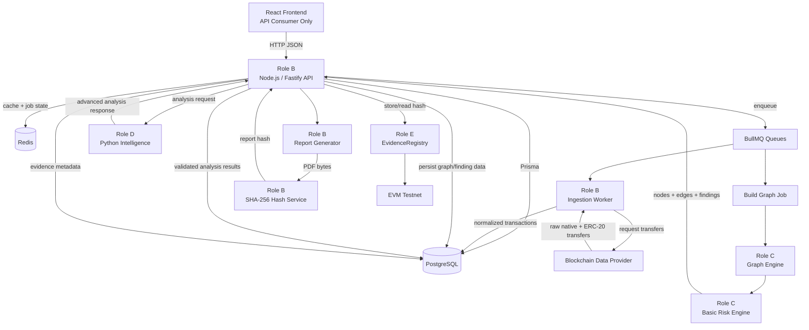
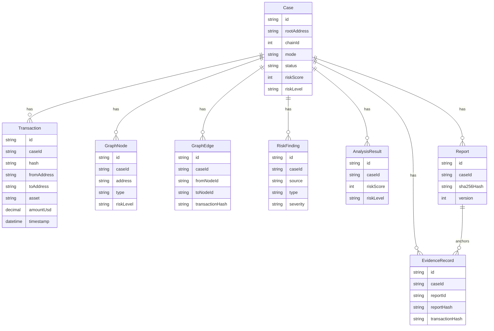
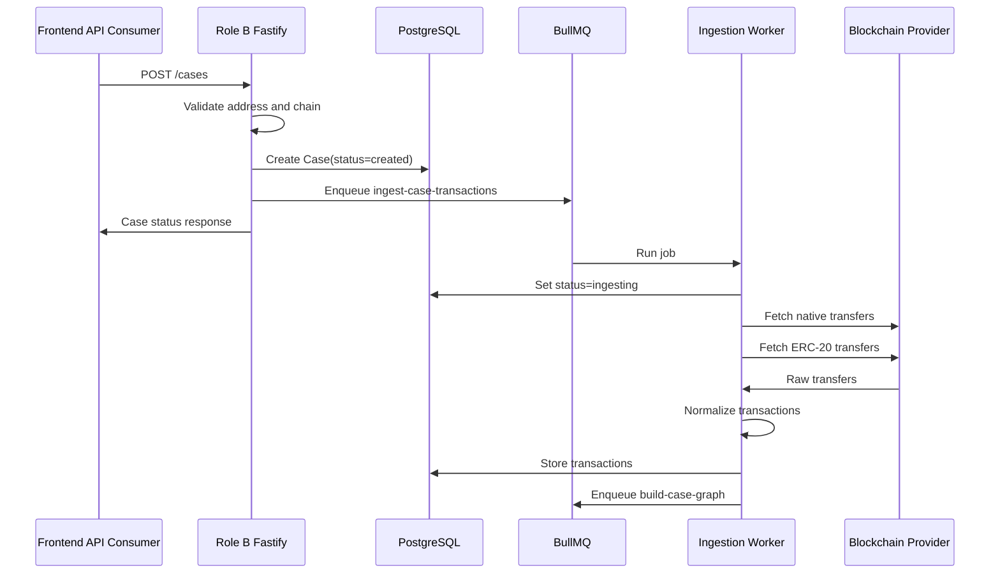
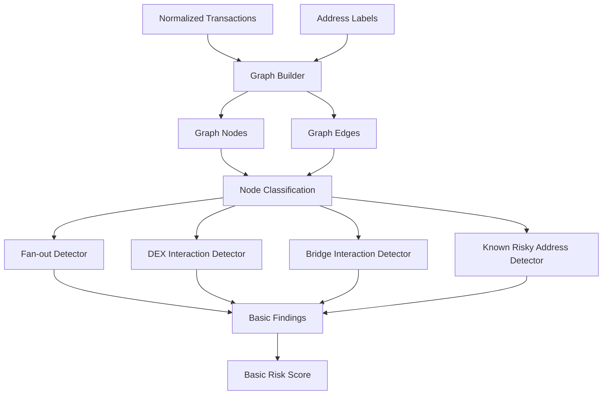
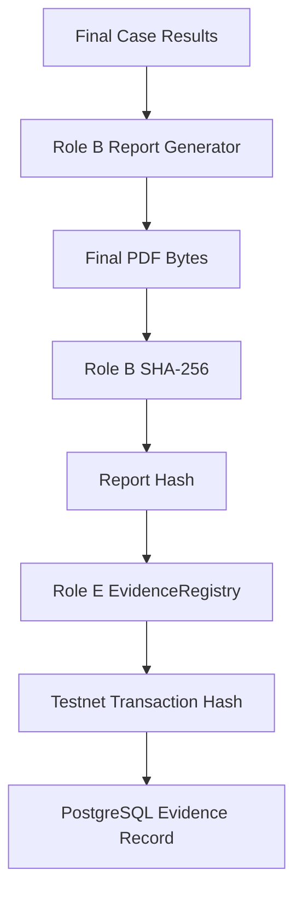
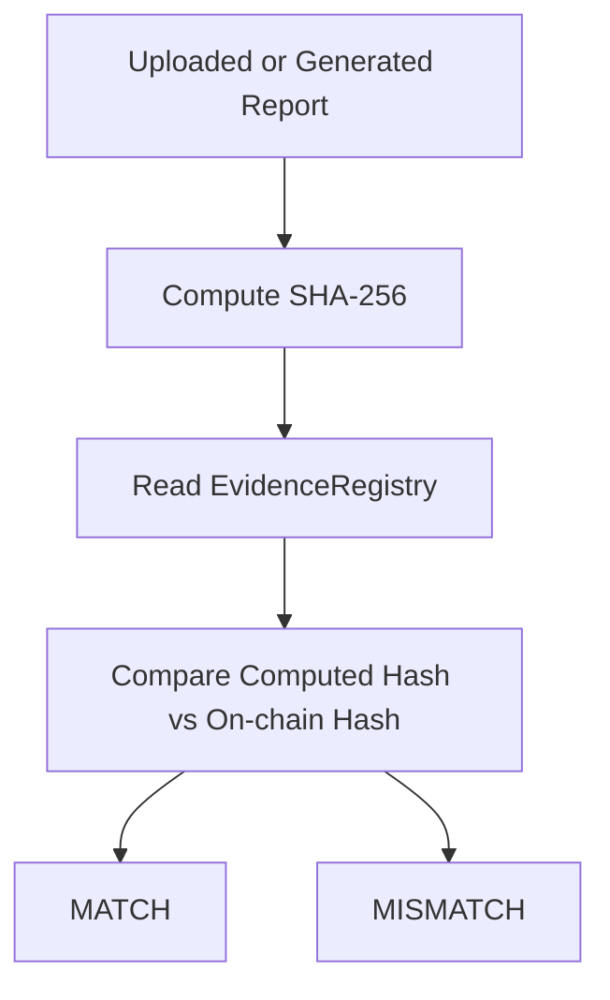

# BACKEND PLAN

## 1. Backend Purpose and Responsibilities

The backend exists to turn one investigator-supplied EVM wallet address into a structured forensic case: transactions, graph, basic risk findings, advanced analysis, report hash, and tamper-evident verification metadata.

The React frontend is only a consumer of Fastify APIs. It does not own forensic logic, persistence, blockchain ingestion, Python orchestration, report hashing, or smart contract writes.

### Role B - Node.js Backend and Data Pipeline

Role B owns the main application backend.

| Area | Responsibility |
|---|---|
| Fastify API | REST endpoints, request validation, response shaping, API errors |
| Case lifecycle | Create cases, update status, expose investigation state |
| PostgreSQL/Prisma | Persist cases, wallets, transactions, findings, analysis, reports, evidence |
| Redis/BullMQ | Run ingestion, graph, analysis, report, and evidence jobs |
| Blockchain provider | Fetch native and ERC-20 transfers for one supported EVM chain |
| Normalization | Convert raw provider results into shared transaction DTOs |
| Orchestration | Call Role C graph/risk modules and Role D Python service |
| Reporting | Generate final PDF report from stored case data |
| Hashing | Compute SHA-256 from finalized PDF bytes |
| Evidence integration | Call Role E contract through ethers.js |
| Seeded fallback | Keep a demo path available when live providers fail |

Role B should not implement advanced graph algorithms inside Fastify. It calls Role C and Role D surfaces through explicit contracts.

### Role C - Graph and Basic Risk

Role C owns deterministic graph construction and rule-based risk detection.

| Area | Responsibility |
|---|---|
| Graph builder | Convert normalized transactions into stable nodes and edges |
| IDs | Produce stable node IDs and edge IDs used by frontend, Python, and database |
| Classification | Label wallets, contracts, exchanges, DEX routers, bridges, risky addresses |
| Basic detectors | Fan-out, DEX interaction, bridge interaction, known risky address |
| Basic scoring | Produce explainable rule-based risk score and level |
| Findings | Emit findings with related node IDs, edge IDs, signals, severity, and confidence |

Role C does not fetch blockchain data, write directly to PostgreSQL, generate reports, or store evidence on-chain.

### Role D - Python Intelligence

Role D owns the Python FastAPI forensic intelligence service.

| Area | Responsibility |
|---|---|
| Analysis API | `POST /v1/analyze` |
| Schemas | Pydantic request and response DTOs |
| Traversal | Bounded multi-hop analysis, 2-3 hops for MVP |
| Detection | Suspicious paths and circular-flow candidates |
| Ranking | Rank paths by risk signals, value, speed, labels, and hop structure |
| Advanced scoring | Produce advanced risk score and explainable findings |

Python must not write directly to PostgreSQL. Fastify sends the normalized graph payload to Python, validates the response, and persists accepted results.

### Role E - Blockchain Evidence Integrity

Role E owns the Solidity evidence layer and deployment handoff.

| Area | Responsibility |
|---|---|
| Contract | `EvidenceRegistry.sol` |
| Tests | Hash storage, versioning, retrieval, mismatch scenarios, access rules |
| Deployment | Hardhat deployment to one EVM testnet |
| Handoff | ABI, deployed address, chain ID, explorer URL, env var names |
| Integration support | Help Role B call contract methods through ethers.js |

Sensitive investigation data must never be stored on-chain. The contract stores only evidence hashes and minimal verification metadata.

## 2. Complete Backend Architecture



Data ownership remains simple:

| Data | Owner | Storage |
|---|---|---|
| Cases | Role B | PostgreSQL |
| Normalized transactions | Role B | PostgreSQL |
| Graph nodes and edges | Role C produces, Role B persists | PostgreSQL or regenerated from transactions |
| Basic findings | Role C produces, Role B persists | PostgreSQL |
| Advanced analysis | Role D produces, Role B validates and persists | PostgreSQL |
| Reports | Role B | Local/object storage path plus metadata in PostgreSQL |
| Evidence hash | Role B computes, Role E stores | Contract plus PostgreSQL metadata |

## 3. Monorepo and Backend Folder Structure

```text
apps/
  api/
    src/
      server.ts
      app.ts
      plugins/
        prisma.ts
        redis.ts
        queues.ts
        env.ts
      db/
        prisma/
          schema.prisma
          migrations/
      modules/
        cases/
          cases.routes.ts
          cases.service.ts
          cases.schemas.ts
        wallets/
          wallets.service.ts
          wallets.validation.ts
        transactions/
          transactions.service.ts
          transactions.repository.ts
        blockchain/
          providers/
            evmProvider.client.ts
          normalizeTransactions.ts
          blockchain.types.ts
        graph/
          graph.builder.ts
          graph.routes.ts
          graph.service.ts
          graph.types.ts
        risk/
          fanOut.detector.ts
          dex.detector.ts
          bridge.detector.ts
          riskyAddress.detector.ts
          riskScoring.ts
          risk.service.ts
        analysis/
          intelligence.client.ts
          analysis.routes.ts
          analysis.service.ts
          analysis.validation.ts
        reports/
          report.generator.ts
          reports.routes.ts
          reports.service.ts
        evidence/
          evidence.contract.ts
          evidence.routes.ts
          evidence.service.ts
          hash.service.ts
      jobs/
        ingestCaseTransactions.job.ts
        buildCaseGraph.job.ts
        analyzeCase.job.ts
        generateReport.job.ts
        registerEvidence.job.ts
      clients/
        ethers.client.ts
        http.client.ts
      datasets/
        seeded-case.json
        address-labels.json
      utils/
        errors.ts
        ids.ts
        time.ts
        logger.ts

  intelligence/
    app/
      main.py
      api/
        routes.py
      schemas/
        investigation.py
        analysis_result.py
      graph/
        builder.py
      traversal/
        multi_hop.py
      detection/
        circular_flows.py
        suspicious_paths.py
      scoring/
        risk_score.py
      ranking/
        path_ranker.py
      tests/

  contracts/
    contracts/
      EvidenceRegistry.sol
    scripts/
      deploy.ts
      storeEvidence.ts
      verifyEvidence.ts
    test/
      EvidenceRegistry.test.ts

packages/
  shared-types/
    src/
      api-contracts.ts
      investigation.ts
      evidence.ts
      index.ts
```

### Important Module Contracts

| Module | Owner | Responsibility | Input | Output |
|---|---|---|---|---|
| `cases` | Role B | Case creation, status, lifecycle | Wallet address, chain ID, mode | Case status DTO |
| `wallets` | Role B | Address validation and wallet records | EVM address | Canonical wallet record |
| `blockchain` | Role B | Provider calls and raw transfer fetching | Wallet, chain, depth | Raw transfer arrays |
| `normalizeTransactions.ts` | Role B | Normalize provider-specific transfers | Raw native/ERC-20 transfers | `NormalizedTransaction[]` |
| `transactions` | Role B | Persist and query normalized transactions | Normalized transactions | Stored transaction rows |
| `graph` | Role C with Role B route wrapper | Build/read graph | Transactions, labels | Nodes and edges |
| `risk` | Role C | Basic deterministic detectors | Graph, transactions, labels | Basic findings and risk score |
| `analysis` | Role B client, Role D service | Advanced Python orchestration | Graph payload | Validated analysis result |
| `reports` | Role B | Generate PDF evidence report | Final case data | Report record and PDF bytes/path |
| `evidence` | Role B integration, Role E contract | Store and verify hash | Report hash, case ID | Evidence record and verification result |
| `jobs` | Role B | Async pipeline execution | Job payloads | Updated case state |
| `intelligence` | Role D | Advanced forensic algorithms | Analysis request | Analysis response |
| `contracts` | Role E | Evidence hash registry | Hash and hashed case ID | Testnet transaction and read result |

## 4. Database Architecture

The MVP database should stay small. PostgreSQL stores application state and investigation data. The contract stores only hashes.

### Entities

| Entity | Important Fields | Relationships | Owner/Module |
|---|---|---|---|
| `Case` | `id`, `rootAddress`, `chainId`, `mode`, `status`, `riskScore`, `riskLevel`, `createdAt`, `updatedAt`, `errorMessage` | Has many transactions, graph nodes, graph edges, findings, reports, evidence records | Role B / `cases` |
| `Wallet` | `id`, `address`, `chainId`, `label`, `type`, `riskLevel`, `createdAt` | Referenced by transactions and graph nodes | Role B / `wallets` |
| `Transaction` | `id`, `caseId`, `hash`, `chainId`, `blockNumber`, `fromAddress`, `toAddress`, `asset`, `tokenAddress`, `amount`, `amountUsd`, `timestamp`, `transferType`, `method`, `rawProviderRef` | Belongs to case | Role B / `transactions` |
| `GraphNode` | `id`, `caseId`, `address`, `type`, `labelsJson`, `riskLevel`, `totalInUsd`, `totalOutUsd` | Belongs to case, referenced by findings | Role C produces, Role B persists |
| `GraphEdge` | `id`, `caseId`, `fromNodeId`, `toNodeId`, `transactionHash`, `asset`, `amount`, `amountUsd`, `timestamp`, `hopDepth`, `riskLevel` | Belongs to case, references graph nodes | Role C produces, Role B persists |
| `RiskFinding` | `id`, `caseId`, `source`, `type`, `severity`, `confidence`, `title`, `description`, `relatedNodeIdsJson`, `relatedEdgeIdsJson`, `signalsJson`, `createdAt` | Belongs to case | Role C/Role D produce, Role B persists |
| `AnalysisResult` | `id`, `caseId`, `analysisRequestId`, `riskScore`, `riskLevel`, `suspiciousPathsJson`, `circularFlowsJson`, `metadataJson`, `createdAt` | Belongs to case | Role D produces, Role B persists |
| `Report` | `id`, `caseId`, `status`, `filePath`, `sha256Hash`, `generatedAt`, `version` | Belongs to case, may have evidence record | Role B / `reports` |
| `EvidenceRecord` | `id`, `caseId`, `reportId`, `caseKeyHash`, `reportHash`, `contractAddress`, `transactionHash`, `chainId`, `version`, `storedAt`, `verifiedAt`, `verificationStatus` | Belongs to case and report | Role B/Role E / `evidence` |

Graph persistence is optional for very small demos, but recommended for the MVP because it stabilizes frontend reads, Python references, report generation, and verification.



## 5. Transaction Ingestion Pipeline



### Role B Ownership

Role B owns the full ingestion path:

- Validate EVM address format.
- Validate supported chain ID.
- Create case record.
- Enqueue ingestion job.
- Call blockchain provider.
- Fetch native transfers and ERC-20 transfers.
- Normalize transfer records.
- Persist normalized transactions.
- Update case status and failure reason.
- Switch to seeded fallback when configured or when live provider fails during demo mode.

### Normalized Transaction Schema

```json
{
  "id": "tx_001",
  "caseId": "case_123",
  "hash": "0xabc...",
  "chainId": 80002,
  "blockNumber": 123456,
  "from": "0x111...",
  "to": "0x222...",
  "asset": "USDC",
  "tokenAddress": "0xtoken...",
  "amount": "250.00",
  "amountUsd": 250,
  "timestamp": "2026-08-21T10:00:00.000Z",
  "transferType": "erc20",
  "method": "transfer"
}
```

### Retry and Failure Behavior

| Situation | Behavior |
|---|---|
| Provider timeout | Retry with exponential backoff, then mark ingestion failed |
| Rate limit | Retry after delay if provider gives retry hint |
| Invalid wallet | Reject `POST /cases` with `400` |
| Unsupported chain | Reject `POST /cases` with `400` |
| No transactions | Store empty result and continue to graph phase with low-risk empty graph |
| Live provider unavailable in demo mode | Load `seeded-case.json` and mark case `demo_fallback_used` |
| Live provider unavailable in live mode | Mark case `failed` and expose readable error |

Recommended BullMQ retry configuration for MVP:

| Setting | Value |
|---|---|
| Attempts | 3 |
| Backoff | Exponential, starting at 5 seconds |
| Timeout | 30-60 seconds per provider call |
| Dead-letter handling | Keep failed job data and case error message |

## 6. Graph and Basic Risk Engine

Role C owns graph construction and basic risk detection. Role B calls these modules and persists the result.



### Graph Builder Input

```json
{
  "caseId": "case_123",
  "rootAddress": "0x111...",
  "transactions": [],
  "addressLabels": []
}
```

### Graph Builder Output

```json
{
  "caseId": "case_123",
  "nodes": [
    {
      "id": "wallet:0x111...",
      "address": "0x111...",
      "type": "wallet",
      "labels": ["root"],
      "riskLevel": "medium",
      "totalInUsd": 1200,
      "totalOutUsd": 900
    }
  ],
  "edges": [
    {
      "id": "edge:0xabc...:0",
      "from": "wallet:0x111...",
      "to": "wallet:0x222...",
      "transactionHash": "0xabc...",
      "asset": "USDC",
      "amount": "250.00",
      "amountUsd": 250,
      "timestamp": "2026-08-21T10:00:00.000Z",
      "hopDepth": 1,
      "riskLevel": "medium"
    }
  ]
}
```

### Basic Finding Output

```json
{
  "id": "finding_001",
  "caseId": "case_123",
  "source": "basic-risk",
  "type": "fan_out",
  "severity": "high",
  "confidence": 0.9,
  "title": "Fan-out detected",
  "description": "Root wallet sent funds to 8 wallets within 12 minutes.",
  "relatedNodeIds": ["wallet:0x111..."],
  "relatedEdgeIds": ["edge:0xabc...:0"],
  "signals": ["many_outputs", "short_time_window"]
}
```

### Detector Design

| Detector | Input | Rule | Output |
|---|---|---|---|
| Fan-out | Transactions and edges | One address sends to many unique recipients in a short time window | `fan_out` finding |
| DEX interaction | Nodes, edges, labels | Transaction touches known DEX router or swap-like method | `dex_interaction` finding |
| Bridge interaction | Nodes, edges, labels | Transaction touches known bridge contract | `bridge_interaction` finding |
| Known risky address | Nodes, labels | Node address exists in risky-address label set | `known_risky_address` finding |

Each detector should be a pure function:

```ts
type Detector = (input: RiskDetectorInput) => RiskFinding[];
```

Unit tests should pass fixtures into each detector and assert exact finding IDs, related node IDs, related edge IDs, severity, and signals.

### Storage and Python Handoff

Fastify stores:

- Graph nodes.
- Graph edges.
- Basic findings.
- Basic risk score and risk level on the case.

Fastify passes to Python:

- Case ID.
- Root address.
- Max depth.
- Nodes.
- Edges.
- Normalized transactions.
- Basic findings.

## 7. Python Intelligence Service

Role D owns the Python service. It should be deterministic, explainable, and fixture-driven. Do not add ML for the hackathon MVP.

### Endpoint

```text
POST /v1/analyze
```

### Input

```json
{
  "caseId": "case_123",
  "analysisRequestId": "analysis_req_123",
  "rootAddress": "0x111...",
  "maxDepth": 3,
  "nodes": [],
  "edges": [],
  "transactions": [],
  "basicFindings": []
}
```

### Processing

Python performs:

- Build a directed graph from nodes and edges.
- Traverse paths from the root address up to `maxDepth`.
- Detect suspicious paths based on rapid movement, risky labels, DEX/bridge touchpoints, fan-out, and value movement.
- Detect circular-flow candidates where funds return to an earlier node.
- Rank suspicious paths by score.
- Produce an advanced risk score and explainable findings.

### Output

```json
{
  "analysisId": "analysis_123",
  "caseId": "case_123",
  "riskScore": 82,
  "riskLevel": "high",
  "findings": [],
  "suspiciousPaths": [
    {
      "id": "path_001",
      "rank": 1,
      "score": 91,
      "nodeIds": ["wallet:0x111...", "wallet:0x222..."],
      "edgeIds": ["edge:0xabc...:0"],
      "reasonCodes": ["rapid_movement"],
      "summary": "Funds moved quickly through an intermediary."
    }
  ],
  "circularFlows": [],
  "analysisMetadata": {
    "engineVersion": "0.1.0",
    "runtimeMs": 240
  }
}
```

### Future ML Extension Point

Keep ML optional by isolating scoring behind:

```text
scoring/risk_score.py
ranking/path_ranker.py
```

The MVP implementation should use deterministic weighted rules. Later, these modules can call a model without changing the Fastify-Python contract.

## 8. Node.js <-> Python Contract

### Request JSON

```json
{
  "caseId": "case_123",
  "analysisRequestId": "analysis_req_123",
  "rootAddress": "0x111...",
  "maxDepth": 3,
  "nodes": [],
  "edges": [],
  "transactions": [],
  "basicFindings": []
}
```

### Response JSON

```json
{
  "analysisId": "analysis_123",
  "caseId": "case_123",
  "riskScore": 82,
  "riskLevel": "high",
  "findings": [],
  "suspiciousPaths": [],
  "circularFlows": [],
  "analysisMetadata": {
    "engineVersion": "0.1.0",
    "runtimeMs": 240
  }
}
```

### Validation Rules

Fastify validates before calling Python:

- `caseId` exists.
- `rootAddress` is a valid EVM address.
- `maxDepth` is between 1 and 3 for MVP.
- Every edge references existing node IDs.
- Every transaction has `hash`, `from`, `to`, `timestamp`, and `transferType`.

Fastify validates after Python responds:

- `caseId` matches request.
- `riskScore` is between 0 and 100.
- `riskLevel` is one of `low`, `medium`, `high`, `critical`.
- Finding `relatedNodeIds` and `relatedEdgeIds` exist in the submitted graph.
- Suspicious path `nodeIds` and `edgeIds` exist in the submitted graph.
- `analysisMetadata.engineVersion` is present.

### Timeout, Error, and Retry Behavior

| Case | Behavior |
|---|---|
| Python timeout | Mark analysis step failed, keep graph/basic findings available |
| Python 4xx | Do not retry; store validation error |
| Python 5xx | Retry analysis job up to 2 times |
| Invalid Python response | Reject response, store analysis validation error |
| Python unavailable in demo mode | Use seeded analysis response |
| Python unavailable in live mode | Keep case usable with basic findings only |

### Storage

Fastify stores:

- `AnalysisResult`.
- Advanced findings as `RiskFinding` rows with `source = "python-intelligence"`.
- Suspicious paths and circular flows in JSON fields on `AnalysisResult`.
- Updated case `riskScore`, `riskLevel`, and `status`.

### Ownership

| Contract Piece | Owner |
|---|---|
| Shared DTO definitions | Role B and Role D agree on Day 1 |
| Fastify client | Role B |
| Python API implementation | Role D |
| Request validation before call | Role B |
| Pydantic validation inside Python | Role D |
| Response validation before persistence | Role B |

## 9. Redis and BullMQ

BullMQ should coordinate the pipeline without becoming a distributed-systems project.

| Job | Owner | Input | Output | Failure Behavior |
|---|---|---|---|---|
| `ingest-case-transactions` | Role B | `caseId`, `rootAddress`, `chainId`, `mode` | Stored transactions | Retry 3 times; fallback in demo mode; mark failed in live mode |
| `build-case-graph` | Role B orchestrates, Role C logic | `caseId` | Stored nodes, edges, basic findings | Mark graph failed; preserve transactions |
| `analyze-case` | Role B orchestrates, Role D service | `caseId`, graph payload | Stored advanced analysis | Retry Python 5xx/timeouts; fallback seeded in demo |
| `generate-report` | Role B | `caseId` | Report row, PDF path, hash | Mark report failed; preserve analysis |
| `register-evidence` | Role B with Role E contract | `caseId`, `reportId`, `reportHash` | Evidence record with tx hash | Retry RPC failures; keep report hash even if chain write fails |

Recommended queue settings:

| Setting | MVP Recommendation |
|---|---|
| Concurrency | 1-3 workers per queue locally |
| Attempts | 2-3 depending on job |
| Backoff | Exponential |
| Job payload size | Keep small; store large data in PostgreSQL |
| Job chaining | Enqueue next job only after current job completes |
| Observability | Log `caseId`, `jobId`, `status`, and duration |

## 10. Report and Evidence Pipeline



### Report Generation

Role B generates a PDF containing:

- Case ID.
- Root address.
- Chain ID.
- Case creation and analysis timestamps.
- Normalized transaction summary.
- Graph summary.
- Basic findings.
- Advanced findings.
- Suspicious paths.
- Evidence section with report hash once available.

The hash must be computed from finalized PDF bytes. Do not hash intermediate JSON if the verification flow claims to verify the report file.

### Evidence Storage

Role B sends Role E's contract:

- `caseKeyHash`: hash of case identifier or stable case key.
- `reportHash`: SHA-256 hash of finalized PDF.
- `version`: report version, if contract requires it.

Role E contract stores:

- Report hash.
- Case key hash.
- Version.
- Timestamp or block metadata if required.

The contract must not store wallet addresses, transaction hashes, labels, findings, report text, or investigator notes.

### Verification Flow



Verification response:

```json
{
  "caseId": "case_123",
  "reportId": "report_123",
  "computedHash": "0xabc...",
  "onChainHash": "0xabc...",
  "verified": true,
  "contractAddress": "0xregistry...",
  "transactionHash": "0xtx...",
  "chainId": 80002,
  "version": 1,
  "storedAt": "2026-08-21T10:30:00.000Z"
}
```

## 11. API ENDPOINTS

### `POST /cases`

| Field | Details |
|---|---|
| Owner | Role B |
| Request | `{ "rootAddress": "0x...", "chainId": 80002, "mode": "demo" }` |
| Response | Case status DTO |
| Internal flow | Validate request, create case, enqueue `ingest-case-transactions` |
| Database | Insert `Case` |
| Frontend consumer | Case creation screen |

### `GET /cases`

| Field | Details |
|---|---|
| Owner | Role B |
| Request | Query params: optional `status`, `limit`, `cursor` |
| Response | List of case summaries |
| Internal flow | Read cases ordered by `createdAt` |
| Database | Read `Case` |
| Frontend consumer | Case list/dashboard |

### `GET /cases/:caseId`

| Field | Details |
|---|---|
| Owner | Role B |
| Request | Path param `caseId` |
| Response | Case status DTO with step statuses |
| Internal flow | Load case and latest status |
| Database | Read `Case`, optional latest report/evidence |
| Frontend consumer | Case detail status polling |

### `GET /cases/:caseId/transactions`

| Field | Details |
|---|---|
| Owner | Role B |
| Request | Path param `caseId` |
| Response | `NormalizedTransaction[]` |
| Internal flow | Validate case exists, load transactions |
| Database | Read `Transaction` |
| Frontend consumer | Transaction table/detail views |

### `GET /cases/:caseId/graph`

| Field | Details |
|---|---|
| Owner | Role B route, Role C graph output |
| Request | Path param `caseId` |
| Response | `{ "nodes": [], "edges": [] }` |
| Internal flow | Load persisted graph or build from transactions |
| Database | Read `GraphNode`, `GraphEdge`, or `Transaction` |
| Frontend consumer | Graph visualization |

### `GET /cases/:caseId/findings`

| Field | Details |
|---|---|
| Owner | Role B route, Role C/Role D producers |
| Request | Path param `caseId`, optional `source` |
| Response | `RiskFinding[]` |
| Internal flow | Load basic and advanced findings |
| Database | Read `RiskFinding` |
| Frontend consumer | Findings panel |

### `POST /cases/:caseId/analyze`

| Field | Details |
|---|---|
| Owner | Role B client, Role D Python |
| Request | Path param `caseId`; optional `{ "force": true }` |
| Response | Analysis status or completed analysis |
| Internal flow | Build Python request from stored graph, call Python or enqueue job |
| Database | Read graph/transactions/findings; write `AnalysisResult` and advanced findings |
| Frontend consumer | Analysis action/status |

### `POST /cases/:caseId/reports`

| Field | Details |
|---|---|
| Owner | Role B |
| Request | Path param `caseId` |
| Response | Report metadata with hash when complete |
| Internal flow | Generate PDF, hash bytes, store report |
| Database | Insert `Report` |
| Frontend consumer | Report generation action/status |

### `POST /cases/:caseId/evidence`

| Field | Details |
|---|---|
| Owner | Role B integration, Role E contract |
| Request | `{ "reportId": "report_123" }` |
| Response | Evidence record with transaction hash |
| Internal flow | Load report hash, call contract, store evidence metadata |
| Database | Read `Report`; insert `EvidenceRecord` |
| Frontend consumer | Evidence storage action/status |

### `POST /evidence/verify`

| Field | Details |
|---|---|
| Owner | Role B integration, Role E contract |
| Request | `{ "caseId": "case_123", "reportId": "report_123" }` or report upload metadata if supported |
| Response | Evidence verification response |
| Internal flow | Recompute or load report hash, read contract, compare |
| Database | Read `Report`, `EvidenceRecord`; update verification timestamp |
| Frontend consumer | Verification screen |

## 12. BACKEND PHASE PLAN

The project uses exactly five phases.

### PHASE 1 - Backend Foundation

Objective: create the monorepo, backend skeletons, shared DTOs, local infrastructure, contract skeleton, and seeded data.

| Role | Task | Input | Output | Depends On | Can Run Parallel |
|---|---|---|---|---|---|
| B | Scaffold Fastify app | Architecture | `GET /health` | None | C, D, E |
| B | Add Prisma and PostgreSQL config | MVP schema | DB connection | None | D, E |
| B | Add Redis and BullMQ bootstrap | Queue list | Queue plugin | None | C |
| B | Create shared DTO package | Frozen contracts | TypeScript DTOs | B/C/D/E agreement | A uses as API consumer |
| B | Add seeded-case endpoint | Seed file | `GET /demo/seeded-case` | C fixture | A can consume |
| C | Create seeded graph and labels | Transaction schema | `seeded-case.json`, `address-labels.json` | Shared DTO draft | B, D |
| D | Scaffold FastAPI service | Analysis contract | `/health`, mock `/v1/analyze` | Shared DTO draft | B |
| E | Scaffold Hardhat contract | Evidence requirements | Compiling contract | None | B |

Definition of Done:

- [ ] Fastify starts locally.
- [ ] PostgreSQL connection works.
- [ ] Redis connection works.
- [ ] BullMQ can enqueue a test job.
- [ ] Python service starts and returns mock analysis.
- [ ] Contract compiles.
- [ ] Seeded dataset exists.
- [ ] Shared DTOs are frozen for MVP.

### PHASE 2 - Data Pipeline

Objective: create cases, ingest native and ERC-20 transfers, normalize them, and persist transactions.

| Role | Task | Input | Output | Depends On | Can Run Parallel |
|---|---|---|---|---|---|
| B | Implement `POST /cases` | Wallet, chain, mode | Case record and job | Phase 1 | C tests |
| B | Implement `GET /cases/:caseId` | Case ID | Case status | Phase 1 | A consumes |
| B | Implement provider client | Wallet, chain | Raw transfers | Env config | C fixture validation |
| B | Implement normalizer | Raw transfers | Normalized transactions | Provider client | C |
| B | Implement ingestion job | Case payload | Stored transactions | Queue setup | C |
| C | Validate transaction fixtures | DTOs | Graph-ready tx fixtures | Shared schema | D |
| D | Parse transaction fixture | Normalized txs | Python schema confidence | Shared schema | B |
| E | Write contract unit tests | Fake hashes | Passing contract tests | Contract skeleton | B |

Definition of Done:

- [ ] Case creation works.
- [ ] Invalid wallets return `400`.
- [ ] Native transfer ingestion works or seeded fallback works.
- [ ] ERC-20 transfer ingestion works or seeded fallback works.
- [ ] Normalized transactions are stored.
- [ ] Case status updates through ingestion.
- [ ] Provider failure behavior is visible and readable.

### PHASE 3 - Graph and Basic Risk

Objective: build graph data, run basic detectors, persist findings, and expose graph APIs.

| Role | Task | Input | Output | Depends On | Can Run Parallel |
|---|---|---|---|---|---|
| C | Implement graph builder | Normalized transactions | Nodes and edges | Phase 2 schema | D |
| C | Implement node classification | Nodes, labels | Labeled nodes | Labels fixture | B |
| C | Implement fan-out detector | Transactions/edges | Finding | Graph builder | B |
| C | Implement DEX detector | Labels/edges | Finding | Address labels | B |
| C | Implement bridge detector | Labels/edges | Finding | Address labels | B |
| C | Implement risky-address detector | Labels/nodes | Finding | Address labels | B |
| C | Implement basic scoring | Findings | Risk score/level | Detectors | D |
| B | Implement graph job | Case ID | Stored graph/findings | C modules | A consumes |
| B | Implement graph/findings APIs | Case ID | API responses | Stored graph | A consumes |
| D | Align Python parser with graph DTO | Graph fixture | Valid request parsing | C output | E |
| E | Prepare deployment env docs | Testnet config | `.env.example` entries | Contract tests | B |

Definition of Done:

- [ ] Graph nodes and edges use stable IDs.
- [ ] Basic findings reference valid nodes and edges.
- [ ] Risk score is deterministic.
- [ ] `GET /cases/:caseId/graph` works.
- [ ] `GET /cases/:caseId/findings` works.
- [ ] Detector unit tests pass.

### PHASE 4 - Intelligence and Evidence

Objective: integrate Python advanced analysis, generate reports, hash finalized PDFs, and store hashes on-chain.

| Role | Task | Input | Output | Depends On | Can Run Parallel |
|---|---|---|---|---|---|
| D | Implement multi-hop traversal | Graph request | Candidate paths | Phase 3 graph | E |
| D | Implement circular-flow detection | Directed graph | Circular flows | Graph parser | B |
| D | Implement path ranking | Paths/signals | Ranked suspicious paths | Traversal | B |
| D | Implement advanced score | Findings/paths | Risk score/level | Ranking | B |
| B | Implement Python client | Graph payload | Validated response | D endpoint | E |
| B | Implement `POST /cases/:caseId/analyze` | Case ID | Stored analysis | Python client | A consumes |
| B | Implement report generator | Final case data | PDF | Analysis data | E |
| B | Implement SHA-256 service | PDF bytes | Report hash | Report generator | E |
| E | Deploy contract | Contract tests | ABI/address/chain ID | Testnet env | B |
| B/E | Implement evidence storage | Report hash | Evidence tx/record | Contract deploy | A consumes |

Definition of Done:

- [ ] Python returns deterministic advanced analysis.
- [ ] Fastify validates Python responses.
- [ ] Advanced findings are stored.
- [ ] PDF report is generated.
- [ ] SHA-256 hash is computed from final PDF bytes.
- [ ] Contract stores report hash on testnet.
- [ ] Evidence record stores transaction hash and contract metadata.

### PHASE 5 - Integration and Final Demo

Objective: make the full backend pipeline reliable, testable, demo-ready, and resilient to live dependency failure.

| Role | Task | Input | Output | Depends On | Can Run Parallel |
|---|---|---|---|---|---|
| B | Implement `POST /evidence/verify` | Report/case | Verification result | Evidence record | E |
| B | Add full seeded pipeline | Seed case | End-to-end demo | All phases | A consumes |
| B | Add integration tests | Seeded case | Passing API flow | All endpoints | C/D/E |
| B | Add error handling | Failure scenarios | Clear API errors | All modules | A consumes |
| C | Tune detectors | Demo fixture | Explainable findings | Phase 3 | D |
| D | Add pytest scenarios | Graph fixtures | Passing Python tests | Phase 4 | C |
| E | Test mismatch/version flows | Contract + hashes | Verification confidence | Contract deploy | B |
| B/C/D/E | Final README backend sections | Real commands/env | Demo-ready docs | Completed system | A references APIs |

Definition of Done:

- [ ] Full seeded demo works end-to-end.
- [ ] Live mode works when provider/RPC credentials are available.
- [ ] Verification supports match and mismatch outcomes.
- [ ] Backend tests pass for critical paths.
- [ ] Python tests pass for traversal and detection.
- [ ] Contract tests pass.
- [ ] README commands match the real project.

## 13. Integration Points

### Role B -> Role C: Normalized Transactions

| Field | Details |
|---|---|
| Input | `NormalizedTransaction[]`, root address, address labels |
| Processing | Role C builds graph and basic risk findings |
| Output | Graph nodes, graph edges, basic findings, basic risk score |
| Failure behavior | Fastify marks graph step failed and keeps transactions available |

### Role C -> Role D: Graph + Basic Findings

| Field | Details |
|---|---|
| Input | Nodes, edges, transactions, basic findings |
| Processing | Python validates and builds directed graph |
| Output | Ready analysis payload inside Python |
| Failure behavior | Python returns 4xx for invalid contract; Fastify stores analysis error |

### Role D -> Role B: Advanced Analysis

| Field | Details |
|---|---|
| Input | Python analysis response |
| Processing | Fastify validates IDs, scores, levels, and metadata |
| Output | Stored `AnalysisResult` and advanced findings |
| Failure behavior | Invalid response is rejected; basic findings remain available |

### Role B -> Role E: Report Hash

| Field | Details |
|---|---|
| Input | `caseKeyHash`, `reportHash`, `version` |
| Processing | Contract stores or updates evidence hash |
| Output | Transaction hash, contract address, chain ID |
| Failure behavior | Report remains generated; evidence status becomes `storage_failed` |

### Role E -> Role B: Verification Result

| Field | Details |
|---|---|
| Input | Contract read result for case key/version |
| Processing | Fastify compares on-chain hash with computed report hash |
| Output | Verification response with `verified: true/false` |
| Failure behavior | RPC failure returns retryable API error; missing evidence returns verified `false` with reason |

## 14. Backend Dependency and Bottleneck Audit

### Is Role B Overloaded?

Yes. Role B owns the central application, persistence, queues, ingestion, orchestration, reports, and contract calls.

Practical solutions:

- Freeze shared contracts on Day 1.
- Implement mock endpoints before live ingestion.
- Let Role C fully own graph/risk modules.
- Let Role E pair on ethers.js integration.
- Let Role D provide a mock Python response immediately.
- Keep seeded fallback as a first-class path.

### Is Role C Sufficiently Independent?

Yes, if normalized transaction fixtures and address labels are available on Day 1. Role C can build graph construction and detector tests without waiting for live blockchain ingestion.

### Can Role D Work Using Seeded Fixtures?

Yes. Role D only needs the Python analysis request fixture: case ID, root address, nodes, edges, transactions, and basic findings.

### Is Role E Underloaded?

Potentially after contract deployment. Give Role E explicit ownership of:

- Contract tests.
- Deployment scripts.
- `storeEvidence.ts`.
- `verifyEvidence.ts`.
- ABI/address handoff.
- Evidence README section.
- Pairing with Role B on contract integration.

### What Should Be Mocked on Day 1?

- `GET /demo/seeded-case`.
- `POST /cases` returning a seeded case in demo mode.
- `GET /cases/:caseId/graph`.
- `GET /cases/:caseId/findings`.
- Python `/v1/analyze` deterministic response.
- Fake evidence transaction hash until contract deployment.

### Contracts to Freeze First

- Case status DTO.
- Normalized transaction DTO.
- Graph node DTO.
- Graph edge DTO.
- Risk finding DTO.
- Python analysis request DTO.
- Python analysis response DTO.
- Evidence verification response DTO.

### Highest-Risk Integrations

| Risk | Why It Matters | Mitigation |
|---|---|---|
| Provider rate limits | Live demo can fail | Seeded fallback and Redis cache |
| Graph schema drift | Breaks frontend and Python | Freeze graph DTOs on Day 1 |
| Invalid Python references | Breaks highlighting and reports | Fastify validates node/edge IDs |
| Non-deterministic PDF hash | Verification fails | Hash finalized PDF bytes only |
| Testnet RPC instability | Evidence demo can fail | Pre-store seeded report hash |
| Role B bottleneck | Blocks all roles | Mock endpoints and clear contracts first |

## 15. Backend Definition of Done

The backend is complete when:

- [ ] Case creation works through `POST /cases`.
- [ ] Wallet and chain validation are implemented.
- [ ] Transactions can be ingested from the supported EVM chain.
- [ ] Native transfers are normalized and stored.
- [ ] ERC-20 transfers are normalized and stored.
- [ ] Seeded fallback works without live blockchain APIs.
- [ ] Case status updates are persisted and exposed.
- [ ] Graph nodes and edges are generated with stable IDs.
- [ ] Graph APIs return stored or regenerated graph data.
- [ ] Fan-out detection works.
- [ ] DEX interaction detection works.
- [ ] Bridge interaction detection works.
- [ ] Known risky address detection works.
- [ ] Basic risk score and findings are explainable.
- [ ] Python advanced analysis runs from the Fastify graph payload.
- [ ] Python does not access PostgreSQL directly.
- [ ] Fastify validates Python responses before persistence.
- [ ] Suspicious paths and circular flows are stored.
- [ ] Reports can be generated from final case data.
- [ ] SHA-256 is computed from finalized PDF bytes.
- [ ] Evidence hash can be stored on-chain.
- [ ] Sensitive case data is never stored on-chain.
- [ ] Evidence can be verified by comparing computed and on-chain hashes.
- [ ] API errors are consistent and readable.
- [ ] BullMQ jobs retry safely and expose failed states.
- [ ] Critical backend, graph, Python, and contract tests pass.
- [ ] Full seeded pipeline works end-to-end for the demo.
- [ ] README includes backend setup, env vars, commands, fallback mode, and demo flow.
