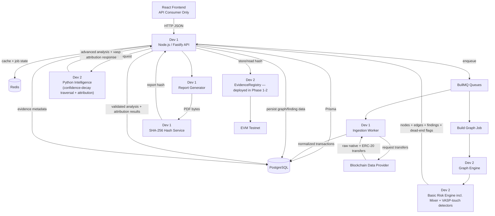
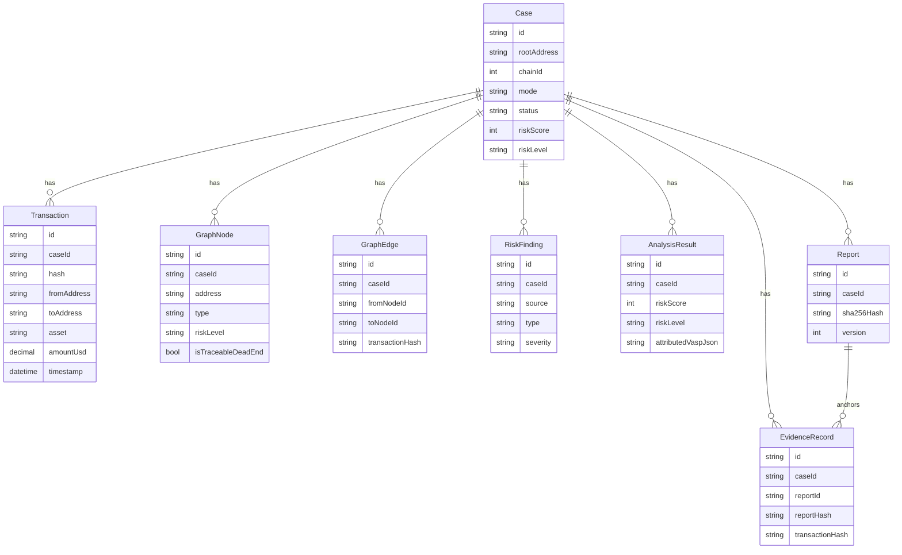
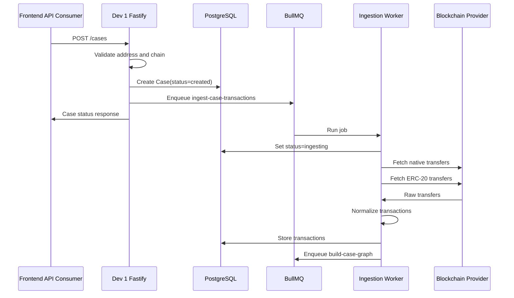
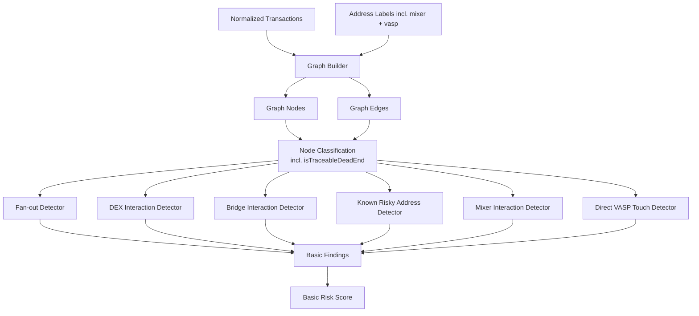
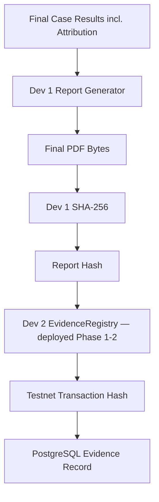

# BACKEND PLAN

## 0. Changelog

### Version 3 — Two-Person Team Structure `[NEW]`

This version does **not** cut any feature. Every capability from v2 —
confidence-decay traversal, node-type pruning, mixer detection, VASP
attribution, suspicion-first search, circular-flow detection — stays in the
plan exactly as designed. What changes is **who builds what, and in what
order**, because the real team is two people:

- **Dev 1** owns everything previously labeled **Role B** (Fastify API,
  database, job queues, ingestion, orchestration, report generation,
  evidence integration).
- **Dev 2** owns everything previously labeled **Role C + Role D + Role E**
  combined (graph engine, basic risk detectors, Python intelligence
  service, and the Solidity evidence contract).

Section 0.5 explains the ownership mapping and the one scheduling change
that matters most for a solo Dev 2: **the Solidity contract moves almost
entirely into Phase 1-2**, because it's the one piece of work with zero
dependency on the graph/risk/analysis pipeline, and finishing it early keeps
it from competing with Phase 3-4 — the part of the project that actually
needs Dev 2's full, undivided attention.

Section 16 is new and covers how to use this document with an AI coding
IDE, since that's explicitly how implementation is happening this time.

### Version 2 — Algorithm and Attribution Upgrades

Carried forward unchanged from the prior version:

1. **Traversal upgrade** — fixed `maxDepth = 3` replaced with a
   confidence-decay stopping condition, node-type-based pruning (not
   value-based), and a suspicion-first (priority-queue) search order.
2. **VASP attribution** — aligned to Problem Statement SIH26182,
   reusing the same graph/labels/traversal machinery already built for risk
   detection, pointed at a `vasp` label category instead of a risk category.

## 0.5. Team & Ownership Map for This Build `[NEW]`

| | Dev 1 | Dev 2 (you) |
|---|---|---|
| Owns | Role B in full | Role C + Role D + Role E, all three |
| Runtime | Node.js / Fastify | Node.js (graph/risk) + Python (intelligence) + Solidity (evidence) |
| Primary risk | Orchestration complexity, still real but bounded to one runtime | **Highest concentration of work in the project** — three runtimes, one person |

Because Dev 2 covers three previously-separate roles, **nothing inside Dev
2's own workload is actually parallel** — one person can't build the graph
engine and the Python service at the same time no matter how good the AI
IDE is at drafting code. The only real parallelism in this project is
**between Dev 1 and Dev 2**, so the phase plan (Section 12) is organized
around that fact, not around the four-role fiction from the original draft.

### The one scheduling change that matters most: front-load Role E

The Solidity contract (`EvidenceRegistry.sol`) has **zero dependency** on
transactions, graph data, or analysis results — it only needs to accept a
hash and store it. That makes it the single most decoupled piece of work in
the entire plan, and therefore the best candidate to get **fully finished**
(written, tested, and deployed to testnet) during Phase 1-2, while Dev 1 is
building the Fastify/DB foundation and ingestion pipeline and doesn't yet
need anything from Dev 2 either.

**Why this matters concretely:** if Role E work is left until Phase 4 as
originally sequenced, it lands at exactly the moment Dev 2 also needs to be
deep in confidence-decay traversal and VASP attribution — the hardest part
of the whole system, for one person. Finishing the contract early removes
an entire runtime from Dev 2's plate before the hard part starts. This is
the mechanism by which "don't squeeze anything" is actually achievable —
not by cutting scope, but by moving the one piece of work that doesn't care
about sequencing to the point in the timeline where it costs the least.

Everywhere Section 12 says "Phase 4: deploy contract," treat that as
"already done since Phase 1-2 — this is just wiring it in."

## 1. Backend Purpose and Responsibilities

The backend exists to turn one investigator-supplied EVM wallet address into
a structured forensic case: transactions, graph, basic risk findings,
advanced analysis, nearest-VASP attribution, report hash, and tamper-evident
verification metadata.

The React frontend is only a consumer of Fastify APIs. It does not own
forensic logic, persistence, blockchain ingestion, Python orchestration,
report hashing, or smart contract writes.

### Role B - Node.js Backend and Data Pipeline — **Dev 1**

| Area | Responsibility |
|---|---|
| Fastify API | REST endpoints, request validation, response shaping, API errors |
| Case lifecycle | Create cases, update status, expose investigation state |
| PostgreSQL/Prisma | Persist cases, wallets, transactions, findings, analysis, attribution, reports, evidence |
| Redis/BullMQ | Run ingestion, graph, analysis, report, and evidence jobs |
| Blockchain provider | Fetch native and ERC-20 transfers for one supported EVM chain |
| Normalization | Convert raw provider results into shared transaction DTOs |
| Orchestration | Call Dev 2's graph/risk modules and Python service |
| Reporting | Generate final PDF report from stored case data, including attribution result |
| Hashing | Compute SHA-256 from finalized PDF bytes |
| Evidence integration | Call Dev 2's deployed contract through ethers.js |
| Seeded fallback | Keep a demo path available when live providers fail |

### Role C - Graph and Basic Risk — **Dev 2**

| Area | Responsibility |
|---|---|
| Graph builder | Convert normalized transactions into stable nodes and edges |
| IDs | Produce stable node IDs and edge IDs used by frontend, Python, and database |
| Classification | Label wallets, contracts, exchanges, DEX routers, bridges, mixers, VASPs, risky addresses; flag traceable dead ends |
| Basic detectors | Fan-out, DEX interaction, bridge interaction, known risky address, mixer interaction, direct VASP touch |
| Basic scoring | Produce explainable rule-based risk score and level |
| Findings | Emit findings with related node IDs, edge IDs, signals, severity, and confidence |

### Role D - Python Intelligence — **Dev 2**

| Area | Responsibility |
|---|---|
| Analysis API | `POST /v1/analyze` |
| Schemas | Pydantic request and response DTOs |
| Traversal | Confidence-decay-bounded multi-hop analysis, no fixed hop cap |
| Detection | Suspicious paths and circular-flow candidates |
| Ranking | Suspicion-first priority queue (behavior signals, not transaction value) |
| Advanced scoring | Produce advanced risk score and explainable findings |
| Attribution | Nearest-VASP attribution with hop distance and confidence |

**Because Role C and Role D are the same person, the JSON contract between
them (Section 8) must still be treated as strict and non-negotiable** — not
relaxed just because no separate teammate is enforcing it. This is what
lets Dev 1 mock Dev 2's output and build against a stable shape without
waiting for the real implementation, and what keeps Python from silently
re-implementing label logic that the Node side already owns.

### Role E - Blockchain Evidence Integrity — **Dev 2, front-loaded into Phase 1-2**

| Area | Responsibility |
|---|---|
| Contract | `EvidenceRegistry.sol` |
| Tests | Hash storage, versioning, retrieval, mismatch scenarios, access rules |
| Deployment | Hardhat deployment to one EVM testnet |
| Handoff | ABI, deployed address, chain ID, explorer URL, env var names — delivered to Dev 1 |
| Integration support | Help Dev 1 call contract methods through ethers.js |

Sensitive investigation data must never be stored on-chain. The contract
stores only evidence hashes and minimal verification metadata.

## 2. Complete Backend Architecture



Data ownership remains simple:

| Data | Owner | Storage |
|---|---|---|
| Cases | Dev 1 | PostgreSQL |
| Normalized transactions | Dev 1 | PostgreSQL |
| Graph nodes and edges (with `isTraceableDeadEnd`) | Dev 2 produces, Dev 1 persists | PostgreSQL |
| Basic findings (incl. mixer/VASP-touch) | Dev 2 produces, Dev 1 persists | PostgreSQL |
| Advanced analysis | Dev 2 produces, Dev 1 validates and persists | PostgreSQL |
| VASP attribution result | Dev 2 produces, Dev 1 validates and persists | PostgreSQL (`AnalysisResult.attributedVaspJson`) |
| Reports | Dev 1 | Local/object storage path plus metadata in PostgreSQL |
| Evidence hash | Dev 1 computes, Dev 2's contract stores | Contract plus PostgreSQL metadata |

## 3. Monorepo and Backend Folder Structure

```text
apps/
  api/                                   # Dev 1
    src/
      server.ts
      app.ts
      plugins/
        prisma.ts
        redis.ts
        queues.ts
        env.ts
      db/
        prisma/
          schema.prisma
          migrations/
      modules/
        cases/
          cases.routes.ts
          cases.service.ts
          cases.schemas.ts
        wallets/
          wallets.service.ts
          wallets.validation.ts
        transactions/
          transactions.service.ts
          transactions.repository.ts
        blockchain/
          providers/
            evmProvider.client.ts
          normalizeTransactions.ts
          blockchain.types.ts
        graph/                            # Dev 2 logic, Dev 1 route wrapper
          graph.builder.ts
          graph.routes.ts
          graph.service.ts
          graph.types.ts
        risk/                             # Dev 2
          fanOut.detector.ts
          dex.detector.ts
          bridge.detector.ts
          riskyAddress.detector.ts
          mixer.detector.ts
          vaspDirectTouch.detector.ts
          nodeClassification.ts           # assigns isTraceableDeadEnd
          riskScoring.ts
          risk.service.ts
        attribution/                      # Dev 1 route, Dev 2 producer
          attribution.routes.ts           # GET /cases/:caseId/attribution
          attribution.service.ts
        analysis/                         # Dev 1
          intelligence.client.ts
          analysis.routes.ts
          analysis.service.ts
          analysis.validation.ts
        reports/                          # Dev 1
          report.generator.ts             # includes attribution + dead-end sections
          reports.routes.ts
          reports.service.ts
        evidence/                         # Dev 1 integration, Dev 2 contract
          evidence.contract.ts
          evidence.routes.ts
          evidence.service.ts
          hash.service.ts
      jobs/                               # Dev 1
        ingestCaseTransactions.job.ts
        buildCaseGraph.job.ts
        analyzeCase.job.ts
        generateReport.job.ts
        registerEvidence.job.ts
      clients/
        ethers.client.ts
        http.client.ts
      datasets/                           # Dev 2 maintains content, Dev 1 loads it
        seeded-case.json
        address-labels.json               # "dex", "bridge", "mixer", "sanctioned", "vasp" categories
      utils/
        errors.ts
        ids.ts
        time.ts
        logger.ts

  intelligence/                          # Dev 2, entirely
    app/
      main.py
      api/
        routes.py
      schemas/
        investigation.py
        analysis_result.py
      graph/
        builder.py
      traversal/
        multi_hop.py                     # confidence-decay + node-type stop
        confidence.py                    # decay + evidence-combination formulas
        priority_queue.py                # suspicion-first search order
      detection/
        circular_flows.py
        suspicious_paths.py              # uses priority_score, mixer-aware
      attribution/
        vasp_attribution.py              # nearest-VASP resolution
      scoring/
        risk_score.py                    # confidence x severity_weight model
      ranking/
        path_ranker.py                   # simplified — falls out of priority queue
      tests/

  contracts/                             # Dev 2, finished in Phase 1-2
    contracts/
      EvidenceRegistry.sol
    scripts/
      deploy.ts
      storeEvidence.ts
      verifyEvidence.ts
    test/
      EvidenceRegistry.test.ts

packages/
  shared-types/                          # Frozen together, Day 1, by both devs
    src/
      api-contracts.ts
      investigation.ts
      evidence.ts
      attribution.ts
      index.ts
```

### Important Module Contracts

| Module | Owner | Responsibility | Input | Output |
|---|---|---|---|---|
| `cases` | Dev 1 | Case creation, status, lifecycle | Wallet address, chain ID, mode | Case status DTO |
| `wallets` | Dev 1 | Address validation and wallet records | EVM address | Canonical wallet record |
| `blockchain` | Dev 1 | Provider calls and raw transfer fetching | Wallet, chain, depth | Raw transfer arrays |
| `normalizeTransactions.ts` | Dev 1 | Normalize provider-specific transfers | Raw native/ERC-20 transfers | `NormalizedTransaction[]` |
| `transactions` | Dev 1 | Persist and query normalized transactions | Normalized transactions | Stored transaction rows |
| `graph` | Dev 2 logic, Dev 1 route wrapper | Build/read graph | Transactions, labels | Nodes and edges (with dead-end flags) |
| `risk` | Dev 2 | Basic deterministic detectors incl. mixer + VASP-touch | Graph, transactions, labels | Basic findings and risk score |
| `attribution` | Dev 1 route, Dev 2 producer | Expose nearest-VASP attribution | Case ID | Attribution DTO |
| `analysis` | Dev 1 client, Dev 2 service | Advanced Python orchestration incl. attribution | Graph payload | Validated analysis result |
| `reports` | Dev 1 | Generate PDF evidence report, incl. attribution section | Final case data | Report record and PDF bytes/path |
| `evidence` | Dev 1 integration, Dev 2 contract | Store and verify hash | Report hash, case ID | Evidence record and verification result |
| `jobs` | Dev 1 | Async pipeline execution | Job payloads | Updated case state |
| `intelligence` | Dev 2 | Advanced forensic algorithms + attribution | Analysis request | Analysis response |
| `contracts` | Dev 2 | Evidence hash registry | Hash and hashed case ID | Testnet transaction and read result |

## 4. Database Architecture

The MVP database should stay small. PostgreSQL stores application state and
investigation data. The contract stores only hashes.

### Entities

| Entity | Important Fields | Relationships | Owner/Module |
|---|---|---|---|
| `Case` | `id`, `rootAddress`, `chainId`, `mode`, `status`, `riskScore`, `riskLevel`, `createdAt`, `updatedAt`, `errorMessage` | Has many transactions, graph nodes, graph edges, findings, reports, evidence records | Dev 1 / `cases` |
| `Wallet` | `id`, `address`, `chainId`, `label`, `type`, `riskLevel`, `createdAt` | Referenced by transactions and graph nodes | Dev 1 / `wallets` |
| `Transaction` | `id`, `caseId`, `hash`, `chainId`, `blockNumber`, `fromAddress`, `toAddress`, `asset`, `tokenAddress`, `amount`, `amountUsd`, `timestamp`, `transferType`, `method`, `rawProviderRef` | Belongs to case | Dev 1 / `transactions` |
| `GraphNode` | `id`, `caseId`, `address`, `type`, `labelsJson`, `riskLevel`, `totalInUsd`, `totalOutUsd`, `isTraceableDeadEnd`, `outDegree` | Belongs to case, referenced by findings | Dev 2 produces, Dev 1 persists |
| `GraphEdge` | `id`, `caseId`, `fromNodeId`, `toNodeId`, `transactionHash`, `asset`, `amount`, `amountUsd`, `timestamp`, `hopDepth`, `riskLevel` | Belongs to case, references graph nodes | Dev 2 produces, Dev 1 persists |
| `RiskFinding` | `id`, `caseId`, `source`, `type`, `severity`, `confidence`, `title`, `description`, `relatedNodeIdsJson`, `relatedEdgeIdsJson`, `signalsJson`, `createdAt` | Belongs to case. `type` includes `mixer_interaction`, `vasp_direct_touch` | Dev 2 produces, Dev 1 persists |
| `AnalysisResult` | `id`, `caseId`, `analysisRequestId`, `riskScore`, `riskLevel`, `suspiciousPathsJson`, `circularFlowsJson`, `attributedVaspJson`, `metadataJson`, `createdAt` | Belongs to case | Dev 2 produces, Dev 1 persists |
| `Report` | `id`, `caseId`, `status`, `filePath`, `sha256Hash`, `generatedAt`, `version` | Belongs to case, may have evidence record | Dev 1 / `reports` |
| `EvidenceRecord` | `id`, `caseId`, `reportId`, `caseKeyHash`, `reportHash`, `contractAddress`, `transactionHash`, `chainId`, `version`, `storedAt`, `verifiedAt`, `verificationStatus` | Belongs to case and report | Dev 1/Dev 2 / `evidence` |

Graph persistence is optional for very small demos, but recommended for the
MVP because it stabilizes frontend reads, Python references, report
generation, and verification.



## 5. Transaction Ingestion Pipeline — Dev 1, entirely



Dev 1 owns the full ingestion path end to end. No dependency on Dev 2's
work exists at this stage, which is exactly why this is safe to build in
parallel with Dev 2 finishing the contract (Section 0.5).

### Normalized Transaction Schema

```json
{
  "id": "tx_001",
  "caseId": "case_123",
  "hash": "0xabc...",
  "chainId": 80002,
  "blockNumber": 123456,
  "from": "0x111...",
  "to": "0x222...",
  "asset": "USDC",
  "tokenAddress": "0xtoken...",
  "amount": "250.00",
  "amountUsd": 250,
  "timestamp": "2026-08-21T10:00:00.000Z",
  "transferType": "erc20",
  "method": "transfer"
}
```

### Retry and Failure Behavior

| Situation | Behavior |
|---|---|
| Provider timeout | Retry with exponential backoff, then mark ingestion failed |
| Rate limit | Retry after delay if provider gives retry hint |
| Invalid wallet | Reject `POST /cases` with `400` |
| Unsupported chain | Reject `POST /cases` with `400` |
| No transactions | Store empty result and continue to graph phase with low-risk empty graph |
| Live provider unavailable in demo mode | Load `seeded-case.json` and mark case `demo_fallback_used` |
| Live provider unavailable in live mode | Mark case `failed` and expose readable error |

Recommended BullMQ retry configuration for MVP:

| Setting | Value |
|---|---|
| Attempts | 3 |
| Backoff | Exponential, starting at 5 seconds |
| Timeout | 30-60 seconds per provider call |
| Dead-letter handling | Keep failed job data and case error message |

## 6. Graph and Basic Risk Engine — Dev 2



### Node Classification

Node classification assigns an `isTraceableDeadEnd` flag in addition to
type/label assignment. This flag controls whether Python's traversal
(Section 7) expands past this node at all — Python trusts this flag rather
than re-deriving it, so label logic exists in exactly one place.

| Node classification | Rule to detect it | `isTraceableDeadEnd` |
|---|---|---|
| Ordinary wallet | Low transaction count, no label match | `false` — follow every outgoing edge |
| Labeled exchange / VASP deposit address | Matches `vasp` label category | `true` — this is an integration point; further legal process, not more traversal |
| Labeled mixer/tumbler | Matches `mixer` label category | `true` — trail is deliberately obscured here; do not attempt to trace through |
| Labeled DEX router / bridge contract | Matches `dex`/`bridge` label category | `false` — asset may change but the on-chain trail continues |
| Unlabeled high-degree wallet | `outDegree > HUB_THRESHOLD` (default 500) even with no label | `true` — treated as a probable hub, same as a labeled exchange |

**Explicitly not a pruning rule:** transaction value/amount. Structuring
launderers split funds into many *small* transfers specifically to evade a
value-based filter — pruning by node type, not size, avoids ignoring exactly
the behavior this system exists to catch.

### Graph Builder Input

```json
{
  "caseId": "case_123",
  "rootAddress": "0x111...",
  "transactions": [],
  "addressLabels": []
}
```

### Graph Builder Output

```json
{
  "caseId": "case_123",
  "nodes": [
    {
      "id": "wallet:0x111...",
      "address": "0x111...",
      "type": "wallet",
      "labels": ["root"],
      "riskLevel": "medium",
      "totalInUsd": 1200,
      "totalOutUsd": 900,
      "isTraceableDeadEnd": false,
      "outDegree": 3
    }
  ],
  "edges": [
    {
      "id": "edge:0xabc...:0",
      "from": "wallet:0x111...",
      "to": "wallet:0x222...",
      "transactionHash": "0xabc...",
      "asset": "USDC",
      "amount": "250.00",
      "amountUsd": 250,
      "timestamp": "2026-08-21T10:00:00.000Z",
      "hopDepth": 1,
      "riskLevel": "medium"
    }
  ]
}
```

### Basic Finding Output

```json
{
  "id": "finding_001",
  "caseId": "case_123",
  "source": "basic-risk",
  "type": "fan_out",
  "severity": "high",
  "confidence": 0.9,
  "title": "Fan-out detected",
  "description": "Root wallet sent funds to 8 wallets within 12 minutes.",
  "relatedNodeIds": ["wallet:0x111..."],
  "relatedEdgeIds": ["edge:0xabc...:0"],
  "signals": ["many_outputs", "short_time_window"]
}
```

### Finding: Mixer Interaction

```json
{
  "id": "finding_005",
  "caseId": "case_123",
  "source": "basic-risk",
  "type": "mixer_interaction",
  "severity": "critical",
  "confidence": 0.95,
  "title": "Funds routed through known mixer",
  "description": "Wallet deposited into a labeled mixing service. On-chain trail ends here; further tracing requires off-chain/legal process.",
  "relatedNodeIds": ["wallet:0x333..."],
  "relatedEdgeIds": ["edge:0xdef...:0"],
  "signals": ["known_mixer_address"]
}
```

### Finding: Direct VASP Touch

Cheap, immediate signal raised before Python's deeper attribution runs — a
fast path for the obvious case where the root wallet is 1-2 hops from a
labeled VASP.

```json
{
  "id": "finding_006",
  "caseId": "case_123",
  "source": "basic-risk",
  "type": "vasp_direct_touch",
  "severity": "info",
  "confidence": 0.85,
  "title": "Direct VASP contact detected",
  "description": "Wallet transacted directly with a labeled VASP deposit address.",
  "relatedNodeIds": ["wallet:0x444..."],
  "relatedEdgeIds": ["edge:0xghi...:0"],
  "signals": ["labeled_vasp_address", "hop_distance_1"]
}
```

### Detector Design

| Detector | Input | Rule | Output |
|---|---|---|---|
| Fan-out | Transactions and edges | One address sends to many unique recipients in a short time window | `fan_out` finding |
| DEX interaction | Nodes, edges, labels | Transaction touches known DEX router or swap-like method | `dex_interaction` finding |
| Bridge interaction | Nodes, edges, labels | Transaction touches known bridge contract | `bridge_interaction` finding |
| Known risky address | Nodes, labels | Node address exists in risky-address label set | `known_risky_address` finding |
| Mixer interaction | Nodes, labels | Node address exists in `mixer` label category | `mixer_interaction` finding; node marked `isTraceableDeadEnd` |
| Direct VASP touch | Nodes, edges, labels | Node within 1-2 hops matches `vasp` label category | `vasp_direct_touch` finding |

Each detector should be a pure function:

```ts
type Detector = (input: RiskDetectorInput) => RiskFinding[];
```

Unit tests should pass fixtures into each detector and assert exact finding
IDs, related node IDs, related edge IDs, severity, and signals. **Since an
AI IDE is drafting these, generate the fixture and the test alongside each
detector in the same prompt** — asking for the implementation and its test
together, against a fixture you specify, is what catches a subtly wrong
field name before it propagates into Python's input (see Section 16).

### Storage and Python Handoff

Dev 2's graph/risk module hands Dev 1 (who persists and forwards to Python):

- Graph nodes (incl. `isTraceableDeadEnd`, `outDegree`).
- Graph edges.
- Basic findings (incl. `mixer_interaction`, `vasp_direct_touch`).
- Basic risk score and risk level.

Dev 1 passes to the Python service:

- Case ID.
- Root address.
- `minConfidence`, `decayFactor`, `hardCeilingDepth`.
- Nodes (with dead-end flags).
- Edges.
- Normalized transactions.
- Basic findings.

## 7. Python Intelligence Service — Dev 2

Should be deterministic, explainable, and fixture-driven. Do not add ML for
the hackathon MVP.

### Endpoint

```text
POST /v1/analyze
```

### Input

```json
{
  "caseId": "case_123",
  "analysisRequestId": "analysis_req_123",
  "rootAddress": "0x111...",
  "minConfidence": 0.15,
  "decayFactor": 0.65,
  "hardCeilingDepth": 10,
  "hubThreshold": 500,
  "nodes": [],
  "edges": [],
  "transactions": [],
  "basicFindings": []
}
```

| Field | Meaning | Default |
|---|---|---|
| `minConfidence` | Stop expanding a path once its confidence decays below this value | `0.15` |
| `decayFactor` | Per-hop confidence retention; `0.65` keeps 65% of prior confidence each hop | `0.65` |
| `hardCeilingDepth` | Safety-valve hop limit so a pathological graph can't hang during a live demo. Rarely hit — confidence decay is the real stopping condition | `10` |
| `hubThreshold` | Unlabeled out-degree above which a node is treated as a probable hub and traversal stops | `500` |

### Processing

- Build a directed graph from nodes and edges.
- Traverse paths from the root address using a priority queue ordered by a
  suspicion-based `priority_score`, not breadth-first to a fixed depth.
- Stop expanding a path when: confidence decays below `minConfidence`, OR
  the current node is `isTraceableDeadEnd`, OR `hardCeilingDepth` is reached.
- Detect suspicious paths based on rapid movement, risky labels, DEX/bridge
  touchpoints, fan-out, and value movement.
- Detect circular-flow candidates where funds return to an earlier node.
- Rank suspicious paths by score (a natural byproduct of the priority
  queue order).
- Produce an advanced risk score and explainable findings.
- Compute nearest-VASP attribution as a byproduct of the same traversal —
  see subsection below.

### Confidence Decay Model

```text
confidence_at_hop(n) = base_confidence x (decay_factor ^ n)
```

- `n` counts hops from the *signal's own origin*, not from the root wallet.
- When multiple independent signals apply to the same node, combine them
  with:

```text
combined_confidence = 1 - [(1 - c1) x (1 - c2) x (1 - c3) x ...]
```

  This lets a fresh strong signal dominate the score while weaker, older
  signals still contribute corroboration without being simply summed
  (which could exceed 1.0) or discarded (which would waste real
  corroborating evidence).

### Risk Scoring Model

```text
risk_contribution = confidence x severity_weight
```

| Finding type | Severity weight |
|---|---|
| Sanctioned address hit | 100 |
| Mixer interaction | 90 |
| Fan-out | 55 |
| Bridge/DEX touch | 35 |

A path's overall score for ranking purposes is its **highest single
`risk_contribution`**, not an average.

### Suspicion-First Search

```text
priority_score(path) = weighted sum of:
  - fan_out_detected           (bool)
  - touches_risky_label        (bool)
  - dex_or_bridge_touchpoint   (bool)
  - speed_of_movement          (funds moved within short window)
  - confidence_at_hop(n)
```

Priority is built from **behavior signals, not transaction value** —
deliberate, so a small structuring transfer that's part of an obvious
fan-out still scores high and gets explored before a large, unremarkable
transfer.

```text
maintain a priority queue of candidate paths, ordered by priority_score
pop the highest-scoring path
  if stopping condition met -> record as final suspicious/attribution path
  else -> expand its edges (skipping isTraceableDeadEnd nodes), push results
repeat until queue is empty or a time/compute budget is hit
```

### VASP Attribution

Reuses the exact traversal above, filtered to `vasp`-labeled nodes as the
target instead of risk labels. "Nearest" = fewest hops / highest surviving
confidence when the traversal reaches a `vasp`-labeled node.

```text
attribution_confidence = confidence_at_hop(hop_distance_to_vasp_node)
```

If multiple VASP-labeled nodes are reachable, the one with the highest
`attribution_confidence` is the primary attribution; others may be listed
as secondary candidates.

If no VASP-labeled node is reached before the stopping condition triggers,
attribution is `null` with a reason (e.g. `"trail ended at mixer before
reaching a labeled VASP"`) rather than a forced guess.

### Output

```json
{
  "analysisId": "analysis_123",
  "caseId": "case_123",
  "riskScore": 82,
  "riskLevel": "high",
  "findings": [],
  "suspiciousPaths": [
    {
      "id": "path_001",
      "rank": 1,
      "score": 91,
      "nodeIds": ["wallet:0x111...", "wallet:0x222..."],
      "edgeIds": ["edge:0xabc...:0"],
      "reasonCodes": ["rapid_movement"],
      "summary": "Funds moved quickly through an intermediary."
    }
  ],
  "circularFlows": [],
  "vaspAttribution": {
    "attributedVasp": "Binance",
    "vaspNodeId": "wallet:0x999...",
    "hopDistance": 2,
    "confidence": 0.74,
    "pathNodeIds": ["wallet:0x111...", "wallet:0x777...", "wallet:0x999..."],
    "pathEdgeIds": ["edge:0xaaa...:0", "edge:0xbbb...:1"],
    "basis": "connected via 2 hops to labeled Binance deposit address",
    "secondaryCandidates": []
  },
  "analysisMetadata": {
    "engineVersion": "0.2.0",
    "runtimeMs": 240
  }
}
```

`vaspAttribution` is `null` (not omitted) when no confident match is found.

### Future ML Extension Point

Keep ML optional by isolating scoring behind:

```text
scoring/risk_score.py
ranking/path_ranker.py
attribution/vasp_attribution.py
```

The MVP implementation should use deterministic weighted rules.

## 8. Node.js <-> Python Contract

Even though both sides are built by the same person, this contract is
**more** important to keep strict, not less — it's what lets Dev 1 build
and test against a stable, mocked shape without waiting on the real Python
implementation, and it's what an AI IDE needs pinned down explicitly so it
doesn't quietly rename a field between sessions.

### Request JSON

```json
{
  "caseId": "case_123",
  "analysisRequestId": "analysis_req_123",
  "rootAddress": "0x111...",
  "minConfidence": 0.15,
  "decayFactor": 0.65,
  "hardCeilingDepth": 10,
  "hubThreshold": 500,
  "nodes": [],
  "edges": [],
  "transactions": [],
  "basicFindings": []
}
```

### Response JSON

```json
{
  "analysisId": "analysis_123",
  "caseId": "case_123",
  "riskScore": 82,
  "riskLevel": "high",
  "findings": [],
  "suspiciousPaths": [],
  "circularFlows": [],
  "vaspAttribution": null,
  "analysisMetadata": {
    "engineVersion": "0.2.0",
    "runtimeMs": 240
  }
}
```

### Validation Rules

Dev 1 validates before calling Python:

- `caseId` exists.
- `rootAddress` is a valid EVM address.
- `minConfidence` is between 0 and 1; `decayFactor` is between 0 and 1;
  `hardCeilingDepth` is a positive integer, recommended ceiling 10-15.
- Every edge references existing node IDs.
- Every transaction has `hash`, `from`, `to`, `timestamp`, and `transferType`.

Dev 1 validates after Python responds:

- `caseId` matches request.
- `riskScore` is between 0 and 100.
- `riskLevel` is one of `low`, `medium`, `high`, `critical`.
- Finding `relatedNodeIds` and `relatedEdgeIds` exist in the submitted graph.
- Suspicious path `nodeIds` and `edgeIds` exist in the submitted graph.
- If `vaspAttribution` is non-null, `vaspNodeId`, `pathNodeIds`, and
  `pathEdgeIds` exist in the submitted graph.
- `analysisMetadata.engineVersion` is present.

### Timeout, Error, and Retry Behavior

| Case | Behavior |
|---|---|
| Python timeout | Mark analysis step failed, keep graph/basic findings available |
| Python 4xx | Do not retry; store validation error |
| Python 5xx | Retry analysis job up to 2 times |
| Invalid Python response | Reject response, store analysis validation error |
| Python unavailable in demo mode | Use seeded analysis response |
| Python unavailable in live mode | Keep case usable with basic findings only |

### Storage

Dev 1 stores:

- `AnalysisResult`, including `attributedVaspJson`.
- Advanced findings as `RiskFinding` rows with `source = "python-intelligence"`.
- Suspicious paths and circular flows in JSON fields on `AnalysisResult`.
- Updated case `riskScore`, `riskLevel`, and `status`.

### Ownership

| Contract Piece | Owner |
|---|---|
| Shared DTO definitions | Both, frozen together on Day 1 |
| Fastify client | Dev 1 |
| Python API implementation | Dev 2 |
| Request validation before call | Dev 1 |
| Pydantic validation inside Python | Dev 2 |
| Response validation before persistence | Dev 1 |

## 9. Redis and BullMQ — Dev 1

| Job | Input | Output | Failure Behavior |
|---|---|---|---|
| `ingest-case-transactions` | `caseId`, `rootAddress`, `chainId`, `mode` | Stored transactions | Retry 3 times; fallback in demo mode; mark failed in live mode |
| `build-case-graph` | `caseId` | Stored nodes, edges, basic findings | Mark graph failed; preserve transactions |
| `analyze-case` | `caseId`, graph payload | Stored advanced analysis + attribution | Retry Python 5xx/timeouts; fallback seeded in demo |
| `generate-report` | `caseId` | Report row, PDF path, hash | Mark report failed; preserve analysis |
| `register-evidence` | `caseId`, `reportId`, `reportHash` | Evidence record with tx hash | Retry RPC failures; keep report hash even if chain write fails |

**Performance note:** cache wallet/label lookups in Redis keyed by
`address:chainId` so repeated cases touching the same wallet don't re-fetch
or re-classify it. Supports the "minutes not hours" demo pitch with no
architecture change.

Recommended queue settings:

| Setting | MVP Recommendation |
|---|---|
| Concurrency | 1-3 workers per queue locally |
| Attempts | 2-3 depending on job |
| Backoff | Exponential |
| Job payload size | Keep small; store large data in PostgreSQL |
| Job chaining | Enqueue next job only after current job completes |
| Observability | Log `caseId`, `jobId`, `status`, and duration |

## 10. Report and Evidence Pipeline



### Report Generation

Dev 1 generates a PDF containing:

- Case ID, root address, chain ID, timestamps.
- Normalized transaction summary.
- Graph summary.
- Basic findings.
- Advanced findings.
- Suspicious paths.
- Nearest-VASP attribution result, including confidence and "why" basis, or
  an explicit "no confident match" statement.
- Mixer dead-end explanation where applicable — phrased as a finding
  ("trail ends here"), not a failure.
- Evidence section with report hash once available.

The hash must be computed from finalized PDF bytes, not intermediate JSON.

### Evidence Storage and Verification Flow

Because the contract (Dev 2) is already deployed by the time this phase
starts, this step is pure integration for Dev 1: call the known ABI/address
with the computed hash, store the returned transaction hash, and expose
`POST /evidence/verify` to recompute-and-compare on demand.

## 11. API Endpoints

### `GET /cases/:caseId/attribution`

| Field | Details |
|---|---|
| Owner | Dev 1 route, Dev 2 (Python) producer |
| Request | Path param `caseId` |
| Response | `vaspAttribution` object (or `null` with reason) |
| Internal flow | Load `AnalysisResult.attributedVaspJson`; if analysis hasn't run, trigger it or return `pending` |
| Database | Read `AnalysisResult` |
| Frontend consumer | Attribution panel — the headline result screen for PS26182 |

*(All other endpoints — `POST /cases`, `GET /cases`, `GET /cases/:caseId`,
`GET /cases/:caseId/transactions`, `GET /cases/:caseId/graph`,
`GET /cases/:caseId/findings`, `POST /cases/:caseId/analyze`,
`POST /cases/:caseId/reports`, `POST /cases/:caseId/evidence`,
`POST /evidence/verify` — all Dev 1, unchanged in shape from prior version.)*

## 12. BACKEND PHASE PLAN `[restructured for 2 people]`

Five phases, same as before. The difference is the **"Owner" and "Can Run
Parallel" columns now reflect two real people**, not four fictional roles —
and Role E is pulled forward into Phase 1-2 in full, not just skeletoned.

### PHASE 1 - Foundation

| Owner | Task | Output | Can Run In Parallel With |
|---|---|---|---|
| Dev 1 | Bare Fastify server, Postgres + Redis connections | Running skeleton | Dev 2's work below |
| Dev 1 | Freeze shared DTOs in `packages/shared-types` (incl. attribution DTO) | Agreed types both devs code against | — do this together first, before splitting off |
| Dev 2 | Prepare seeded/fake case (`seeded-case.json`) | Demo-safe fixture data | Dev 1's server setup |
| **Dev 2** | **Write full `EvidenceRegistry.sol` + complete test suite** | **Passing contract tests** | **Everything above — zero dependency** |
| **Dev 2** | **Deploy contract to testnet** | **ABI, address, chain ID, explorer URL handed to Dev 1** | Continue in parallel |
| Dev 2 | Stand up Python service skeleton, returns hardcoded fake analysis | Running skeleton | Dev 1's work |

**This phase is where "front-load Role E" actually happens.** By the end
of Phase 1, the contract should be *done*, not just started — freeing all
of Dev 2's remaining time for the graph/risk/intelligence work, which is
where the real complexity is.

### PHASE 2 - Data Pipeline — Dev 1, entirely

| Task | Output |
|---|---|
| `POST /cases` | Case creation endpoint |
| Blockchain provider integration (Etherscan/Alchemy/Covalent) | Raw transfer fetching |
| Normalization | Clean `NormalizedTransaction[]` |
| Seeded fallback wiring | Demo never breaks on live API failure |

Dev 2 has no dependency here and should be finishing Phase 1 contract work
or starting the graph builder skeleton against the seeded case.

### PHASE 3 - Graph and Basic Risk — Dev 2, entirely

| Task | Input | Output | Notes |
|---|---|---|---|
| Graph builder | Normalized transactions | Nodes and edges | |
| Node classification incl. `isTraceableDeadEnd` + `outDegree` | Nodes, labels | Labeled nodes | |
| Fan-out, DEX, bridge, risky-address detectors | Transactions/edges/labels | Findings | Four detectors, same pattern each — good candidates to batch through the AI IDE one at a time (Section 16) |
| Mixer detector | Labels/nodes | `mixer_interaction` finding | |
| Direct VASP-touch detector | Labels/nodes/edges | `vasp_direct_touch` finding | |
| Add `vasp` and `mixer` categories to address-labels dataset | Reference lists (Etherscan labels, OFAC, known mixers) | Updated `address-labels.json` | |
| Basic scoring | Findings | Risk score/level | |

Dev 1, in parallel: build the graph/findings job wrapper and API routes
against the *frozen* output shape (Section 6), using a hand-written fixture
if Dev 2's real implementation isn't finished yet. This is real
Dev1/Dev2 parallelism, not Dev 2 parallelizing with themself.

### PHASE 4 - Intelligence and Evidence Integration

| Owner | Task | Depends On |
|---|---|---|
| Dev 2 | Confidence decay module (`traversal/confidence.py`) | Phase 3 graph fixture |
| Dev 2 | Multi-hop traversal using confidence-decay stopping condition | Confidence module |
| Dev 2 | Suspicion-first priority queue (`traversal/priority_queue.py`) | Traversal |
| Dev 2 | Circular-flow detection | Graph parser |
| Dev 2 | Path ranking (byproduct of priority queue order) | Priority queue |
| Dev 2 | Advanced score using confidence x severity_weight model | Ranking |
| Dev 2 | `attribution/vasp_attribution.py` | Traversal, confidence module |
| Dev 1 | Python client incl. new request/response fields | Dev 2's endpoint (mock first, swap in real once ready) |
| Dev 1 | `POST /cases/:caseId/analyze` | Python client |
| Dev 1 | `GET /cases/:caseId/attribution` | Analysis storage |
| Dev 1 | Report generator incl. attribution + mixer dead-end sections | Analysis data |
| Dev 1 | SHA-256 service | Report generator |
| Dev 1 | Wire in Dev 2's already-deployed contract via ethers.js | **Already done in Phase 1** — this is integration only, not new contract work |

This is the heaviest phase for Dev 2 — it's the entire "smart layer." It
being the *only* thing on Dev 2's plate this phase (contract already
shipped, basic detectors already done) is the payoff of the Phase 1
front-loading decision.

### PHASE 5 - Integration and Final Demo

| Owner | Task |
|---|---|
| Dev 1 | `POST /evidence/verify` |
| Dev 1 | Full seeded pipeline, end-to-end |
| Dev 1 | Integration tests across all endpoints |
| Dev 1 | Error handling across all modules |
| Dev 2 | Tune detectors against demo fixture |
| **Dev 2** | **Tune `decayFactor`, `minConfidence`, `hubThreshold` against the seeded case** — these are starting assumptions, not validated numbers; confirm they produce sensible rankings before demo day |
| Dev 2 | Pytest scenarios incl. attribution and confidence-decay edge cases |
| Both | Final README, demo script, and fallback rehearsal |

## 13. Integration Points

### Dev 1 <-> Dev 2: Graph and Basic Risk

Same as the original Role B/C boundary — Dev 1 calls the graph/risk module,
persists the result, and treats it as an external dependency even though
it's the same person, so the interface stays honest.

### Dev 1 <-> Dev 2: Python Analysis

Dev 1 sends the frozen request shape, validates the response strictly
(Section 8) before persisting anything — this is the checkpoint that
catches drift between the Node and Python sides of Dev 2's own work.

### Dev 1 <-> Dev 2: VASP Attribution

| Field | Details |
|---|---|
| Input | Python attribution result (or `null`) |
| Processing | Dev 1 validates `vaspNodeId`/path IDs exist in submitted graph before persisting |
| Output | Stored `AnalysisResult.attributedVaspJson`; exposed via `GET /cases/:caseId/attribution` |
| Failure behavior | Invalid or missing attribution stores as `null` with a reason string; case remains usable with risk findings alone |

### Dev 1 <-> Dev 2: Evidence Contract

Because this is finished in Phase 1-2, this "integration point" in Phase 4
is just Dev 1 calling a known, already-tested ABI — the lowest-risk
integration in the whole project, by design.

## 14. Dependency and Bottleneck Audit `[re-audited for 2 people]`

The single biggest structural risk in this build is **Dev 2 is now the
critical path for graph logic, risk detection, Python intelligence, VASP
attribution, and (briefly, in Phase 1) the smart contract.** That's real,
and no amount of planning removes it — but it can be managed:

| Mitigation | Why it helps |
|---|---|
| Front-load Role E into Phase 1-2 (Section 0.5) | Removes an entire runtime from Dev 2's plate before the hardest phase (4) begins |
| Freeze all DTOs on Day 1, before either dev writes real logic | Lets Dev 1 build against mocks without waiting on Dev 2's real implementation |
| Dev 1 always builds against a hand-written fixture first, swaps in Dev 2's real output later | Decouples Dev 1's timeline from Dev 2's, even though there's no separate teammate forcing this |
| One module per AI IDE session, verified against its fixture before moving on (Section 16) | Prevents unverified code from piling up — the single easiest failure mode for a solo dev leaning on AI-generated code across many files |
| Tune `decayFactor`/`hubThreshold` in Phase 5 against real seeded data | These are placeholder defaults; treat them as such, not as finished values |

### Highest-Risk Integrations

| Risk | Why It Matters | Mitigation |
|---|---|---|
| Provider rate limits | Live demo can fail | Seeded fallback and Redis cache |
| Graph schema drift | Breaks frontend and Python | Freeze graph DTOs on Day 1 |
| Invalid Python references | Breaks highlighting and reports | Dev 1 validates node/edge IDs strictly |
| Non-deterministic PDF hash | Verification fails | Hash finalized PDF bytes only |
| Testnet RPC instability | Evidence demo can fail | Contract already deployed early; pre-store a seeded report hash as backup |
| **Dev 2 overload across three runtimes** | **Single point of failure for the entire forensic engine** | **Phase 1 front-loading + strict fixture-first development + AI IDE used module-by-module, not "build the whole engine" in one prompt** |
| Untuned `decayFactor`/`hubThreshold`/incomplete `vasp`+`mixer` label coverage | Attribution or risk output could look arbitrary if constants aren't validated | Tune against seeded case in Phase 5; keep label ingestion pluggable |

## 15. Definition of Done

- [ ] Case creation works through `POST /cases`.
- [ ] Wallet and chain validation are implemented.
- [ ] Transactions can be ingested from the supported EVM chain.
- [ ] Native transfers are normalized and stored.
- [ ] ERC-20 transfers are normalized and stored.
- [ ] Seeded fallback works without live blockchain APIs.
- [ ] Case status updates are persisted and exposed.
- [ ] **Contract is written, tested, and deployed by end of Phase 1-2, not Phase 4.**
- [ ] Graph nodes and edges are generated with stable IDs.
- [ ] Graph nodes carry `isTraceableDeadEnd` and `outDegree`.
- [ ] Graph APIs return stored or regenerated graph data.
- [ ] Fan-out, DEX, bridge, and known-risky-address detection all work.
- [ ] Mixer interaction detection works and correctly marks nodes as dead ends.
- [ ] Direct VASP-touch detection works.
- [ ] Basic risk score and findings are explainable.
- [ ] Python advanced analysis runs from the Fastify graph payload.
- [ ] Python traversal stops on confidence decay or dead-end nodes, not a fixed hop count.
- [ ] Priority-queue search explores suspicious paths first.
- [ ] Nearest-VASP attribution is computed with hop distance and confidence, or explicitly `null` with a reason.
- [ ] `GET /cases/:caseId/attribution` returns the attribution result.
- [ ] Python does not access PostgreSQL directly.
- [ ] Fastify validates Python responses before persistence, including attribution node/path references.
- [ ] Suspicious paths and circular flows are stored.
- [ ] Reports can be generated from final case data, including the attribution result and mixer dead-end explanations.
- [ ] SHA-256 is computed from finalized PDF bytes.
- [ ] Evidence hash can be stored on-chain.
- [ ] Sensitive case data is never stored on-chain.
- [ ] Evidence can be verified by comparing computed and on-chain hashes.
- [ ] API errors are consistent and readable.
- [ ] BullMQ jobs retry safely and expose failed states.
- [ ] `decayFactor`, `minConfidence`, and `hubThreshold` have been tuned against the seeded case, not left at untested defaults.
- [ ] **Every module was verified against its own fixture/test before the next module was started** (see Section 16).
- [ ] Critical backend, graph, Python, and contract tests pass.
- [ ] Full seeded pipeline works end-to-end for the demo.
- [ ] README includes backend setup, env vars, commands, fallback mode, and demo flow.

## 16. Working With an AI Coding IDE `[NEW]`

This plan is written to be handed to an AI IDE module-by-module. A few
rules make that actually work instead of producing subtly inconsistent code
across files:

### One module per prompt, not one phase per prompt

Ask for `fanOut.detector.ts` on its own, with its fixture and test, before
asking for `dex.detector.ts`. A prompt like "build the whole risk engine"
tends to produce five detectors that each invent slightly different field
names for the same concept — exactly the kind of drift that's invisible
until Python (or a test) chokes on it.

### Always paste the frozen contract into the prompt

Before asking the AI IDE to implement any module, include the exact JSON
shape from this document that the module must produce or consume (e.g. the
Graph Builder Output block in Section 6, or the Python Input/Output blocks
in Section 7). Don't describe the shape from memory and let the model infer
field names — paste it. This is the single highest-leverage habit for
avoiding contract drift.

### Generate the fixture and the test in the same prompt as the implementation

For every detector, traversal function, or endpoint: ask for the
implementation, a fixture that exercises it, and a test asserting the exact
output shape — together. Verify that test passes before moving to the next
module. An unverified module sitting in the codebase is a landmine for
whatever gets built on top of it next.

### Keep Node.js and Python work in separate IDE sessions/threads

Since Role C and Role D are literally the same runtime split (TypeScript vs
Python) built by the same person, mixing them in one long AI IDE
conversation increases the odds that logic gets duplicated across
languages — for instance, the AI reintroducing mixer-label matching inside
Python when that logic already lives in Node's `nodeClassification.ts`.
Start a fresh session per language, and re-paste the relevant contract each
time.

### Treat the Solidity contract with extra care

Ask the AI IDE to run `EvidenceRegistry.test.ts` immediately after
generating or modifying the contract, every time — a smart contract bug
caught in Phase 1 testing is cheap; the same bug discovered on demo day,
mid-testnet-transaction, is not.

### Use this document's checklists as your own progress tracker

Section 15's Definition of Done is written at the granularity of "one AI
IDE prompt, roughly." Check items off as you verify them, not as you
generate them — with heavy AI assistance, code volume stops being a good
proxy for progress; passing tests against the fixtures in this document
are.
