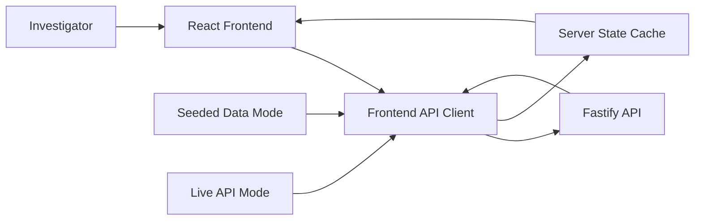
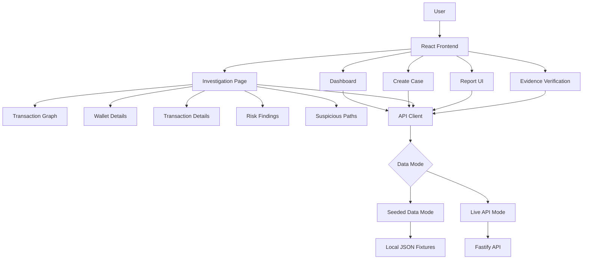
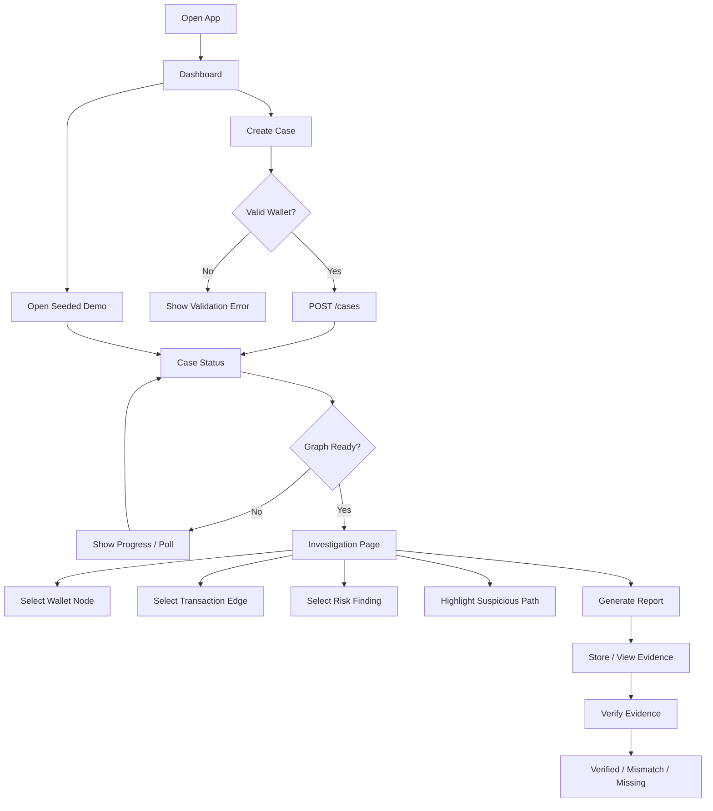
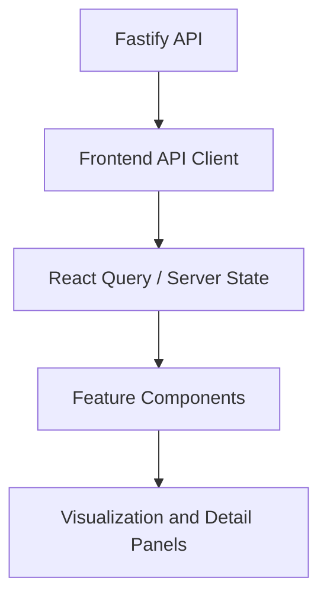

# FRONTEND PLAN

## 1. Frontend Purpose

The frontend is the investigator-facing application for the On-Chain Forensic Triage Engine. It lets a user create an investigation from one EVM wallet address, monitor case progress, inspect a transaction graph, review risk findings, highlight suspicious flows, generate a report, and verify evidence integrity.

The frontend communicates only with the Node.js/Fastify API. It must not call PostgreSQL, Redis, BullMQ, the blockchain provider, the Python intelligence service, or the Solidity contract directly.

### Frontend responsibilities

| Area | Responsibility |
|---|---|
| Application shell | Routing, layout, navigation, responsive page structure |
| Case workflow | Wallet input, chain selection, demo/live mode, case creation |
| Investigation dashboard | Case status, risk score, phase progress, report/evidence status |
| Graph visualization | Cytoscape graph rendering, node/edge selection, highlighting |
| Detail panels | Wallet, transaction, finding, path, report, and evidence views |
| Risk presentation | Severity badges, explanations, related graph element highlighting |
| Analysis UX | Loading states, polling, failures, fallback demo states |
| Report UI | Report generation button, report status, report hash display |
| Evidence verification | Verification form, match/mismatch/missing states |
| Seeded demo | Full frontend demo using fixture data from Day 1 |

### Frontend should NOT handle

| Backend concern | Reason |
|---|---|
| Blockchain ingestion | Provider logic, retries, rate limits, and normalization belong in Fastify workers |
| Graph/risk computation | Frontend displays nodes, edges, findings, and paths; it does not infer financial crime |
| Python analysis | Frontend consumes analysis results returned by Fastify |
| Database writes | All persistence is behind Fastify APIs |
| Redis/BullMQ jobs | Frontend only shows status returned by Fastify |
| Smart contract reads/writes | Evidence storage and contract reads are mediated by Fastify |
| PDF hashing | Frontend displays report hashes; Fastify hashes finalized PDF bytes |

### Data flow



## 2. Frontend System Architecture



### Data mode strategy

| Mode | Purpose | Used when |
|---|---|---|
| Seeded Data Mode | Enables full frontend development and reliable hackathon demo without backend availability | Day 1 development, fallback demo, offline presentation |
| Live API Mode | Uses real Fastify endpoints and live case status | Integration phases and final demo when services are running |

Both modes must expose the same repository interface so UI components do not care whether data came from fixtures or Fastify.

## 3. Pages and User Flow

### 1. Dashboard

| Item | Detail |
|---|---|
| Purpose | Show existing investigations, risk summary, and entry points for new or demo cases |
| Components | `AppShell`, `DashboardHeader`, `CaseList`, `CaseSummaryCard`, `DemoCaseButton` |
| Required data | Case summaries, statuses, risk levels, created timestamps |
| API endpoint | `GET /cases` |
| Loading state | Skeleton case rows and disabled actions |
| Error state | Inline API error with retry and demo fallback |
| Empty state | Prompt to create a case or open seeded demo |
| Seeded fallback | Render one seeded high-risk investigation case |

### 2. Create Investigation / Create Case

| Item | Detail |
|---|---|
| Purpose | Start a case from one EVM wallet address |
| Components | `CreateCaseForm`, `WalletAddressInput`, `ChainSelector`, `ModeToggle`, `SubmitButton` |
| Required data | Supported chains, selected mode, root wallet address |
| API endpoint | `POST /cases` |
| Loading state | Submit button spinner and disabled form |
| Error state | Validation message for invalid wallet, API failure banner |
| Empty state | Empty form with supported chain selected |
| Seeded fallback | Submit returns seeded `caseId` and routes to seeded investigation |

### 3. Case Investigation Page

| Item | Detail |
|---|---|
| Purpose | Main workspace for status, graph, findings, paths, reports, and evidence |
| Components | `InvestigationHeader`, `InvestigationStatus`, `InvestigationWorkspace`, `ReportActions`, `EvidenceStatusPanel` |
| Required data | Case status, graph, findings, suspicious paths, report/evidence metadata |
| API endpoint | `GET /cases/:caseId`, `GET /cases/:caseId/graph`, `GET /cases/:caseId/findings` |
| Loading state | Status timeline plus graph skeleton |
| Error state | Recoverable panel with retry and seeded fallback |
| Empty state | Case created but graph not ready yet |
| Seeded fallback | Load seeded case, graph, findings, analysis, and evidence data |

### 4. Transaction Graph View

| Item | Detail |
|---|---|
| Purpose | Visualize wallet and contract relationships as an interactive transaction graph |
| Components | `TransactionGraph`, `GraphToolbar`, `GraphLegend`, `GraphViewport`, `GraphMiniMap` |
| Required data | `GraphNode[]`, `GraphEdge[]`, selected node/edge/path/finding |
| API endpoint | `GET /cases/:caseId/graph` |
| Loading state | Graph canvas placeholder with progress text |
| Error state | Graph-specific error with retry |
| Empty state | No transactions found for this wallet |
| Seeded fallback | Render seeded Cytoscape graph |

### 5. Wallet Details

| Item | Detail |
|---|---|
| Purpose | Explain the selected wallet or contract node |
| Components | `WalletDetailsPanel`, `AddressLabelList`, `RiskSummary`, `FlowTotals`, `RelatedFindings` |
| Required data | Selected `GraphNode`, related edges, related findings |
| API endpoint | Uses loaded graph/findings data |
| Loading state | Panel skeleton if graph is loading |
| Error state | Shows unavailable node details |
| Empty state | Prompt user to select a graph node |
| Seeded fallback | Uses selected seeded node |

### 6. Transaction Details

| Item | Detail |
|---|---|
| Purpose | Explain the selected transaction/edge |
| Components | `TransactionDetailsPanel`, `TransferSummary`, `TransactionMetadata`, `RelatedFindingLinks` |
| Required data | Selected `GraphEdge`, transaction hash, asset, amount, timestamp, hop depth |
| API endpoint | Uses loaded graph data |
| Loading state | Panel skeleton if graph is loading |
| Error state | Shows unavailable transaction details |
| Empty state | Prompt user to select a graph edge |
| Seeded fallback | Uses selected seeded edge |

### 7. Risk Findings

| Item | Detail |
|---|---|
| Purpose | List suspicious signals with severity, confidence, and explanations |
| Components | `RiskFindingsPanel`, `FindingCard`, `FindingSeverityBadge`, `FindingFilterBar` |
| Required data | `GraphFinding[]` |
| API endpoint | `GET /cases/:caseId/findings` |
| Loading state | Finding card skeletons |
| Error state | Findings unavailable message with retry |
| Empty state | No risk findings detected |
| Seeded fallback | Render seeded fan-out, DEX, bridge, or risky-address findings |

### 8. Suspicious Path View

| Item | Detail |
|---|---|
| Purpose | Show ranked paths returned by analysis and highlight them on the graph |
| Components | `SuspiciousPathsPanel`, `SuspiciousPathCard`, `PathReasonCodes`, `PathHighlightButton` |
| Required data | `SuspiciousPath[]` from analysis response |
| API endpoint | `POST /cases/:caseId/analyze` or included in case analysis result |
| Loading state | Analysis progress with disabled path controls |
| Error state | Analysis failed state with retry |
| Empty state | No suspicious paths detected |
| Seeded fallback | Show seeded suspicious paths and highlight graph elements |

### 9. Report Page

| Item | Detail |
|---|---|
| Purpose | Generate and show evidence report metadata |
| Components | `ReportPage`, `ReportActions`, `ReportStatusBadge`, `ReportHashPanel` |
| Required data | Report status, report ID, computed hash, generated timestamp |
| API endpoint | `POST /cases/:caseId/reports` |
| Loading state | Generating report progress |
| Error state | Report generation failed with retry |
| Empty state | Report not generated yet |
| Seeded fallback | Show seeded report hash and ready status |

### 10. Evidence Verification Page

| Item | Detail |
|---|---|
| Purpose | Verify whether a report hash matches stored evidence metadata |
| Components | `EvidenceVerificationPage`, `VerificationForm`, `VerificationResult`, `HashComparisonPanel` |
| Required data | Case/report ID or hash input, computed hash, on-chain hash, verified boolean |
| API endpoint | `POST /evidence/verify` |
| Loading state | Verification in progress |
| Error state | Contract/API verification unavailable |
| Empty state | Form waiting for report/case input |
| Seeded fallback | Render matching and mismatch verification fixtures |

### 11. Demo/Fallback Mode

| Item | Detail |
|---|---|
| Purpose | Guarantee a complete demo without live blockchain APIs |
| Components | `DemoModeBanner`, `SeededCaseLauncher`, `FallbackStatusNotice` |
| Required data | Seeded case, graph, findings, analysis, report, evidence |
| API endpoint | None in pure seeded mode; optional `GET /demo/seeded-case` |
| Loading state | Fixture loading state |
| Error state | Fixture parse/load failure |
| Empty state | Not applicable |
| Seeded fallback | Primary behavior |

### User flow diagram



## 4. Frontend Folder Structure

```text
apps/web/
  src/
    app/
      App.tsx
      router.tsx
      providers.tsx
    pages/
      DashboardPage.tsx
      CreateCasePage.tsx
      CaseInvestigationPage.tsx
      ReportPage.tsx
      EvidenceVerificationPage.tsx
      DemoFallbackPage.tsx
    components/
      ui/
      layout/
      graph/
      investigation/
      findings/
      reports/
      evidence/
      status/
    features/
      cases/
      investigation/
      graph/
      findings/
      analysis/
      reports/
      evidence/
    api/
      client.ts
      repositories.ts
      cases.api.ts
      graph.api.ts
      findings.api.ts
      analysis.api.ts
      reports.api.ts
      evidence.api.ts
    hooks/
      useCase.ts
      useCaseGraph.ts
      useCaseFindings.ts
      useInvestigationSelection.ts
    store/
      investigationUiStore.ts
    types/
      investigation.ts
      api.ts
      graph.ts
      evidence.ts
    mocks/
      mockRepositories.ts
      mockDelay.ts
    data/
      seeded-case.json
      seeded-graph.json
      seeded-findings.json
      seeded-analysis.json
      seeded-evidence.json
    utils/
      address.ts
      formatters.ts
      risk.ts
      graphMapping.ts
```

| Folder | Purpose |
|---|---|
| `app/` | Root app, router, global providers such as React Query |
| `pages/` | Route-level page components |
| `components/ui/` | Reusable buttons, badges, tabs, dialogs, inputs, spinners |
| `components/layout/` | App shell, header, sidebars, responsive page frames |
| `components/graph/` | Cytoscape rendering, toolbar, legend, graph panels |
| `components/investigation/` | Case header, status, workspace composition |
| `components/findings/` | Risk finding cards, filters, severity badges |
| `components/reports/` | Report generation and hash display UI |
| `components/evidence/` | Evidence status and verification components |
| `features/` | Feature-specific hooks, services, mappers, and local helpers |
| `api/` | Real API client plus repository interfaces |
| `hooks/` | Shared hooks for data fetching and UI selection |
| `store/` | Minimal client UI state, especially graph selection and display mode |
| `types/` | Shared TypeScript contracts consumed by UI |
| `mocks/` | Mock repository implementations matching the real API interface |
| `data/` | Seeded JSON fixtures for offline demo and frontend development |
| `utils/` | Formatting, address helpers, risk styles, Cytoscape mapping |

## 5. Component Architecture

```text
CaseInvestigationPage
  InvestigationHeader
  InvestigationStatusTimeline
  InvestigationWorkspace
    GraphRegion
      GraphToolbar
      GraphLegend
      TransactionGraph
      GraphMiniMap
    InspectorPanel
      WalletDetailsPanel
      TransactionDetailsPanel
      FindingDetailsPanel
    FindingsRegion
      RiskFindingsPanel
      SuspiciousPathsPanel
  ReportActionsPanel
  EvidenceStatusPanel
```

### Key components

| Component | Responsibility | Props/input | Data source | Emits events | Depends on |
|---|---|---|---|---|---|
| `DashboardPage` | Shows case list and demo entry | None | `useCases()` | Open/create case | `CaseList`, `DemoCaseButton` |
| `CreateCaseForm` | Captures wallet, chain, mode | Supported chains, initial mode | Local form state | `onSubmit` | `WalletAddressInput`, `ChainSelector` |
| `InvestigationHeader` | Shows case title, root address, risk level | `CaseStatus` | `useCase(caseId)` | None | `RiskBadge` |
| `InvestigationStatusTimeline` | Shows ingestion, graph, analysis, report, evidence status | `CaseSteps` | `useCase(caseId)` | None | `StatusStep` |
| `TransactionGraph` | Renders Cytoscape graph | Nodes, edges, highlights, selected IDs | `useCaseGraph(caseId)` | `onNodeSelect`, `onEdgeSelect`, `onCanvasClick` | Cytoscape |
| `GraphToolbar` | Controls layout, zoom, fit, filters | Layout mode, filters | UI state | `onFit`, `onLayoutChange`, `onFilterChange` | `TransactionGraph` |
| `InspectorPanel` | Chooses correct detail panel | Selected node/edge/finding/path | UI state + graph data | Clear selection | Detail components |
| `WalletDetailsPanel` | Shows selected address details | `GraphNode`, related edges/findings | Graph/findings data | Select related finding | `RiskSummary` |
| `TransactionDetailsPanel` | Shows selected edge details | `GraphEdge`, related findings | Graph/findings data | Select related node/finding | `TransferSummary` |
| `RiskFindingsPanel` | Lists and filters findings | `GraphFinding[]` | `useCaseFindings(caseId)` | `onFindingSelect` | `FindingCard` |
| `SuspiciousPathsPanel` | Lists analysis-ranked paths | `SuspiciousPath[]` | Analysis result | `onPathSelect` | `PathCard` |
| `ReportActionsPanel` | Generates or displays report | Case/report status | `useCase`, report API | `onGenerateReport` | `ReportHashPanel` |
| `EvidenceStatusPanel` | Shows stored evidence metadata | Evidence status | evidence API or case status | Open verification | `EvidenceBadge` |
| `EvidenceVerificationPage` | Verifies report evidence | Case/report/hash input | verification API | Submit verification | `VerificationResult` |

## 6. Cytoscape Graph Architecture

The graph frontend consumes a prepared graph response from Fastify. It does not calculate laundering patterns. It maps API nodes and edges into Cytoscape elements, applies visual styles, and manages selection/highlighting.

### Node representation

Nodes represent wallets, contracts, services, DEX routers, bridges, and risky addresses. The node ID must be stable and match IDs referenced by findings and suspicious paths.

```ts
export type GraphNode = {
  id: string;
  address: string;
  type: "wallet" | "contract" | "dex" | "bridge" | "exchange" | "risky_address";
  labels: string[];
  riskLevel: "low" | "medium" | "high" | "critical";
  totalInUsd: number;
  totalOutUsd: number;
  hopDepth?: number;
};
```

### Edge representation

Edges represent transfers or interactions between graph nodes.

```ts
export type GraphEdge = {
  id: string;
  from: string;
  to: string;
  transactionHash: string;
  asset: string;
  amount: string;
  amountUsd: number;
  timestamp: string;
  transferType: "native" | "erc20" | "contract_call";
  hopDepth: number;
  riskLevel: "low" | "medium" | "high" | "critical";
};
```

### Finding and path structures

```ts
export type GraphFinding = {
  id: string;
  source: "basic-risk" | "python-intelligence";
  type: "fan_out" | "dex_interaction" | "bridge_interaction" | "risky_address" | "circular_flow" | "rapid_movement";
  severity: "low" | "medium" | "high" | "critical";
  confidence: number;
  title: string;
  description: string;
  relatedNodeIds: string[];
  relatedEdgeIds: string[];
  signals: string[];
};

export type SuspiciousPath = {
  id: string;
  rank: number;
  score: number;
  nodeIds: string[];
  edgeIds: string[];
  reasonCodes: string[];
  summary: string;
};
```

### Visual rules

| Concept | Frontend display |
|---|---|
| Root wallet | Distinct border and root label |
| High/critical risk node | Strong risk color and warning marker |
| DEX/bridge/service node | Icon or concise type badge |
| Hop depth | Distance rings or muted depth labels |
| Edge amount | Width scaled by `amountUsd`, capped for readability |
| Edge risk | Color by `riskLevel` |
| Selected node/edge | Focused style plus populated inspector panel |
| Related finding | Highlight all `relatedNodeIds` and `relatedEdgeIds` |
| Suspicious path | Highlight path edges and dim unrelated elements |
| Fan-out | Emphasize one source with multiple outgoing edges |
| Circular flow | Highlight loop edges with a distinct dashed style |

### Interaction model

| Interaction | Behavior |
|---|---|
| Click node | Select wallet/contract and open wallet details |
| Click edge | Select transaction and open transaction details |
| Click finding | Highlight referenced nodes/edges and open finding details |
| Click suspicious path | Highlight path sequence and show path summary |
| Clear selection | Reset graph to normal risk styling |
| Filter by severity | Hide or dim lower severity elements/findings |
| Fit graph | Recenter Cytoscape viewport |
| Change layout | Re-run selected layout without refetching data |

### Layout strategy

| Scenario | Layout |
|---|---|
| Seeded/small graph | `cose` or `breadthfirst` centered on root |
| Flow investigation | Directed layout from root wallet by hop depth |
| Fan-out pattern | Radial emphasis around source wallet |
| Circular flow | Preserve loop visibility with curved/dashed edges |
| 50-150 node MVP graph | Use clustering, zoom controls, minimap, and details-on-select |

Large graph handling for the MVP should stay simple: cap live visual rendering to the investigation scope returned by Fastify, group low-value peripheral nodes when possible, debounce layout changes, and avoid expensive frontend graph computation.

## 7. Frontend API Contract Requirements

Contracts that must be frozen early:

- `POST /cases`
- `GET /cases`
- `GET /cases/:caseId`
- `GET /cases/:caseId/graph`
- `GET /cases/:caseId/findings`
- `POST /cases/:caseId/analyze`
- `POST /cases/:caseId/reports`
- `GET /cases/:caseId/evidence`
- `POST /evidence/verify`

### `GET /cases`

| Item | Detail |
|---|---|
| Request | No body |
| Response | List of case summaries |
| Frontend consumer | `DashboardPage`, `CaseList` |
| UI state affected | Dashboard loading/error/empty states |

```json
{
  "cases": [
    {
      "caseId": "case_123",
      "rootAddress": "0x111...",
      "chainId": 80002,
      "mode": "demo",
      "status": "analysis_complete",
      "riskScore": 82,
      "riskLevel": "high",
      "createdAt": "2026-08-21T10:00:00.000Z"
    }
  ]
}
```

### `POST /cases`

| Item | Detail |
|---|---|
| Request | Root address, chain ID, mode |
| Response | Created case status |
| Frontend consumer | `CreateCaseForm` |
| UI state affected | Form submitting state, route to investigation |

```json
{
  "rootAddress": "0x111...",
  "chainId": 80002,
  "mode": "demo"
}
```

```json
{
  "caseId": "case_123",
  "rootAddress": "0x111...",
  "chainId": 80002,
  "mode": "demo",
  "status": "created",
  "riskScore": 0,
  "riskLevel": "low",
  "steps": {
    "ingestion": "pending",
    "graph": "pending",
    "analysis": "pending",
    "report": "not_started",
    "evidence": "not_started"
  }
}
```

### `GET /cases/:caseId`

| Item | Detail |
|---|---|
| Request | `caseId` path param |
| Response | Case status and workflow steps |
| Frontend consumer | `InvestigationHeader`, `InvestigationStatusTimeline` |
| UI state affected | Polling, phase progress, report/evidence availability |

```json
{
  "caseId": "case_123",
  "rootAddress": "0x111...",
  "chainId": 80002,
  "mode": "demo",
  "status": "analysis_complete",
  "riskScore": 82,
  "riskLevel": "high",
  "steps": {
    "ingestion": "complete",
    "graph": "complete",
    "analysis": "complete",
    "report": "ready",
    "evidence": "stored"
  }
}
```

### `GET /cases/:caseId/graph`

| Item | Detail |
|---|---|
| Request | `caseId` path param |
| Response | Nodes and edges |
| Frontend consumer | `TransactionGraph`, details panels |
| UI state affected | Graph rendering, selection, highlight availability |

```json
{
  "caseId": "case_123",
  "nodes": [],
  "edges": [],
  "metadata": {
    "nodeCount": 24,
    "edgeCount": 42,
    "maxHopDepth": 3
  }
}
```

### `GET /cases/:caseId/findings`

| Item | Detail |
|---|---|
| Request | `caseId` path param |
| Response | Risk findings |
| Frontend consumer | `RiskFindingsPanel`, graph highlighting |
| UI state affected | Findings filters, selected finding, highlighted elements |

```json
{
  "caseId": "case_123",
  "findings": [
    {
      "id": "finding_001",
      "source": "basic-risk",
      "type": "fan_out",
      "severity": "high",
      "confidence": 0.9,
      "title": "Fan-out detected",
      "description": "Root wallet sent funds to multiple wallets within a short window.",
      "relatedNodeIds": ["wallet:0x111"],
      "relatedEdgeIds": ["edge:0xabc:0"],
      "signals": ["many_outputs", "short_time_window"]
    }
  ]
}
```

### `POST /cases/:caseId/analyze`

| Item | Detail |
|---|---|
| Request | Optional analysis trigger |
| Response | Analysis result with advanced findings and suspicious paths |
| Frontend consumer | `SuspiciousPathsPanel`, `RiskFindingsPanel` |
| UI state affected | Analysis loading, path highlighting, advanced risk |

```json
{
  "caseId": "case_123",
  "analysisId": "analysis_123",
  "riskScore": 82,
  "riskLevel": "high",
  "findings": [],
  "suspiciousPaths": [
    {
      "id": "path_001",
      "rank": 1,
      "score": 91,
      "nodeIds": ["wallet:0x111", "wallet:0x222"],
      "edgeIds": ["edge:0xabc:0"],
      "reasonCodes": ["rapid_movement"],
      "summary": "Funds moved quickly through an intermediary."
    }
  ],
  "circularFlows": [],
  "analysisMetadata": {
    "engineVersion": "0.1.0",
    "runtimeMs": 240
  }
}
```

### `POST /cases/:caseId/reports`

| Item | Detail |
|---|---|
| Request | `caseId` path param |
| Response | Report metadata and hash |
| Frontend consumer | `ReportActionsPanel`, `ReportPage` |
| UI state affected | Report generating/ready/error states |

```json
{
  "caseId": "case_123",
  "reportId": "report_123",
  "status": "ready",
  "computedHash": "0xabc...",
  "generatedAt": "2026-08-21T10:30:00.000Z"
}
```

### `GET /cases/:caseId/evidence`

| Item | Detail |
|---|---|
| Request | `caseId` path param |
| Response | Evidence metadata |
| Frontend consumer | `EvidenceStatusPanel` |
| UI state affected | Evidence stored/pending/missing states |

```json
{
  "caseId": "case_123",
  "reportId": "report_123",
  "computedHash": "0xabc...",
  "transactionHash": "0xtx...",
  "contractAddress": "0xregistry...",
  "chainId": 80002,
  "version": 1,
  "storedAt": "2026-08-21T10:30:00.000Z",
  "status": "stored"
}
```

### `POST /evidence/verify`

| Item | Detail |
|---|---|
| Request | Case/report/hash data needed by Fastify |
| Response | Verification result |
| Frontend consumer | `EvidenceVerificationPage`, `VerificationResult` |
| UI state affected | Verified/mismatch/missing/error states |

```json
{
  "caseId": "case_123",
  "reportId": "report_123"
}
```

```json
{
  "caseId": "case_123",
  "reportId": "report_123",
  "computedHash": "0xabc...",
  "onChainHash": "0xabc...",
  "verified": true,
  "contractAddress": "0xregistry...",
  "transactionHash": "0xtx...",
  "chainId": 80002,
  "version": 1,
  "storedAt": "2026-08-21T10:30:00.000Z"
}
```

## 8. Seeded Data and Mock API Strategy

The frontend must be useful before the backend is complete. Seeded data should mirror the real Fastify contracts exactly.

```text
apps/web/src/data/
  seeded-case.json
  seeded-graph.json
  seeded-findings.json
  seeded-analysis.json
  seeded-evidence.json
```

### Repository interface

```ts
export type CaseRepository = {
  listCases(): Promise<CaseSummary[]>;
  createCase(input: CreateCaseInput): Promise<CaseStatus>;
  getCase(caseId: string): Promise<CaseStatus>;
  getGraph(caseId: string): Promise<CaseGraph>;
  getFindings(caseId: string): Promise<GraphFinding[]>;
  analyzeCase(caseId: string): Promise<AnalysisResult>;
  generateReport(caseId: string): Promise<ReportMetadata>;
  getEvidence(caseId: string): Promise<EvidenceMetadata>;
  verifyEvidence(input: VerifyEvidenceInput): Promise<EvidenceVerificationResult>;
};
```

### Implementations

| Implementation | Behavior |
|---|---|
| `MockCaseRepository` | Loads local JSON fixtures and simulates short async delays |
| `ApiCaseRepository` | Calls Fastify with the same return types |
| `createCaseRepository()` | Chooses mock or API mode based on config |

### Mode configuration

```ts
export const dataMode = import.meta.env.VITE_DATA_MODE === "api" ? "api" : "mock";
```

Do not over-engineer this with a complex dependency injection system. A repository factory plus React Query hooks is enough for the hackathon MVP.

## 9. Frontend State Management

Use React Query for server state and a small local store for graph UI state.

| State type | Recommended owner | Examples |
|---|---|---|
| Server state | React Query | Cases, case status, graph, findings, analysis, report, evidence |
| UI state | Component state | Form fields, open tabs, modal visibility |
| Graph selection state | Small Zustand store or React context | Selected node ID, selected edge ID, selected finding ID, selected path ID |
| Investigation state | Derived from server state | Current step, can generate report, can verify evidence |
| Global state | Keep minimal | Data mode, theme, graph selection |

### What should not be global

- Raw form input values
- Temporary loading booleans already handled by React Query
- Derived risk labels that can be computed from fetched data
- Cytoscape instance internals unless needed by graph controls

## 10. FRONTEND PHASE PLAN

### PHASE 1 - Frontend Foundation

| Task | Input | Output | Depends On | Can Run Parallel |
|---|---|---|---|---|
| Set up React + TypeScript app | Monorepo structure | Running frontend shell | None | Yes |
| Add routing | Page list | Dashboard/create/case/report/verify routes | React setup | Yes |
| Create UI layout | UX needs | App shell, navigation, page frames | React setup | Yes |
| Define shared frontend types | Frozen contract draft | `types/investigation.ts`, `types/api.ts` | API contract draft | Yes |
| Add seeded data files | Master seeded schema | Local JSON fixtures | Contract draft | Yes |
| Build mock repository | Seeded data | Mock API client | Seeded files | Yes |
| Build basic dashboard | Case fixture | Case list and demo entry | Mock repository | Yes |

Definition of Done:

- React app starts locally.
- Routes exist for all major pages.
- Dashboard renders from seeded data.
- Mock repository exposes the same methods as planned API repository.
- Frontend can run without backend services.

### PHASE 2 - Case Creation and Investigation Flow

| Task | Input | Output | Depends On | Can Run Parallel |
|---|---|---|---|---|
| Build create case form | Wallet/chain/mode requirements | Working form | Phase 1 | Yes |
| Add wallet validation UI | EVM address format | Inline validation feedback | Form | Yes |
| Add chain selector | Supported chain list | Selected chain ID | Form | Yes |
| Add demo/live toggle | Data mode config | Mode-aware case creation | Mock/API repository | Yes |
| Implement `POST /cases` integration | Fastify endpoint | Live case creation | Backend mock endpoint | With graph UI |
| Add case status polling | `GET /cases/:caseId` | Investigation progress timeline | Case endpoint | Yes |
| Add investigation loading states | Case steps | Progress and waiting states | Status data | Yes |

Definition of Done:

- User can create a seeded/demo case.
- Invalid wallet addresses show clear feedback.
- Case status appears on the investigation page.
- Live API integration can be enabled without rewriting components.
- Loading and failure states are visible.

### PHASE 3 - Graph and Risk Visualization

| Task | Input | Output | Depends On | Can Run Parallel |
|---|---|---|---|---|
| Install and wire Cytoscape | Graph fixture | Rendered graph canvas | Phase 1 types | Yes |
| Map API graph to Cytoscape elements | Nodes/edges | Cytoscape element mapper | Graph contract | Yes |
| Implement node selection | Graph node IDs | Wallet details panel | Graph rendering | Yes |
| Implement edge selection | Graph edge IDs | Transaction details panel | Graph rendering | Yes |
| Add risk styles | `riskLevel` | Risk-colored graph | Graph data | Yes |
| Add fan-out visualization | Related edges | Fan-out highlight style | Findings data | Yes |
| Build findings panel | Findings fixture/API | Severity grouped findings | Findings contract | Yes |
| Highlight finding references | Related IDs | Graph highlight behavior | Graph + findings | Yes |

Definition of Done:

- Seeded and API graph payloads render in Cytoscape.
- Nodes and edges can be selected.
- Wallet and transaction details update from selection.
- Findings are understandable and clickable.
- Clicking a finding highlights the relevant graph elements.
- Graph remains usable for 50-150 nodes.

### PHASE 4 - Advanced Analysis and Evidence UI

| Task | Input | Output | Depends On | Can Run Parallel |
|---|---|---|---|---|
| Add suspicious path panel | Analysis response | Ranked path list | Analysis contract | Yes |
| Add path highlighting | `nodeIds`, `edgeIds` | Highlighted graph route | Graph selection | Yes |
| Add circular flow visualization | Circular flow/path data | Loop highlight style | Analysis data | Yes |
| Merge advanced findings into UI | Analysis findings | Unified findings panel | Findings UI | Yes |
| Build report UI | Report endpoint | Generate/report-ready states | Case status | Yes |
| Display report hash | Report metadata | Hash panel | Report endpoint | Yes |
| Build evidence status panel | Evidence metadata | Stored/missing evidence UI | Evidence endpoint | Yes |
| Build verification UI | Verify endpoint | Match/mismatch result screen | Evidence contract | Yes |

Definition of Done:

- Suspicious paths can be selected and highlighted.
- Advanced findings appear alongside basic findings.
- Report generation flow has loading, success, and error states.
- Report hash is displayed clearly.
- Evidence status is visible.
- Verification screen shows verified, mismatch, missing, and error states.

### PHASE 5 - Integration and Demo Polish

| Task | Input | Output | Depends On | Can Run Parallel |
|---|---|---|---|---|
| Replace mocks endpoint by endpoint | Fastify APIs | Live API mode | Backend availability | Yes |
| Preserve fallback demo mode | Seeded fixtures | Reliable offline demo | Mock repository | Yes |
| Add full error handling | API errors/timeouts | Retry and fallback UX | API integration | Yes |
| Finish loading states | All async actions | Consistent progress UX | Feature pages | Yes |
| Polish responsive layout | Final pages | Demo-ready UI | Feature completion | Yes |
| Add demo script route/state | Seeded case | Predictable presentation flow | Seeded mode | Yes |
| Validate graph interactions | Graph data | Stable selection/highlighting | Graph UI | Yes |

Definition of Done:

- Entire seeded demo works end to end.
- Live API mode works when services are available.
- API failures do not break the demo.
- All major pages have loading, error, and empty states.
- UI is polished enough for a hackathon presentation.
- Role A can explain the frontend architecture and integration boundaries.

## 11. Frontend Dependencies and Integration Points



### Integration map

| Integration | Input | Processing | Output |
|---|---|---|---|
| Graph API -> Cytoscape | `GraphNode[]`, `GraphEdge[]` | Map to Cytoscape elements and styles | Interactive transaction graph |
| Findings API -> Risk Panel | `GraphFinding[]` | Group/filter by severity and source | Finding cards and graph highlights |
| Analysis API -> Suspicious Paths | `SuspiciousPath[]`, advanced findings | Render ranked paths and map IDs to graph elements | Path list and highlighted flows |
| Case API -> Status UI | Case status and step states | Convert steps to timeline badges | Investigator progress visibility |
| Report API -> Report UI | Report status and hash | Show generating/ready/error states | Report action panel and hash display |
| Evidence API -> Evidence Panel | Evidence metadata | Show stored/missing/pending state | Evidence status card |
| Verify API -> Verification Screen | Computed/on-chain hash comparison | Render match/mismatch/missing states | Evidence verification result |

### Dependency boundaries

| Frontend sees | Frontend does not see |
|---|---|
| Fastify REST endpoints | PostgreSQL tables |
| Case and graph JSON contracts | Redis/BullMQ queues |
| Analysis result DTOs | Python service internals |
| Evidence verification DTOs | Solidity contract calls |
| Report metadata and hashes | PDF hash generation internals |

## 12. Frontend Definition of Done

- All major user flows work in seeded mode.
- Dashboard, create case, investigation, report, and verification pages exist.
- A user can create or open a demo investigation case.
- The investigation page shows case status, risk score, and workflow steps.
- The transaction graph is interactive.
- Nodes and edges can be selected.
- Wallet and transaction detail panels update correctly.
- Risk findings are readable and grouped by severity.
- Selecting a finding highlights related graph nodes and edges.
- Suspicious paths can be highlighted on the graph.
- Fan-out and circular-flow visuals are understandable.
- Report generation UI works with loading, success, and error states.
- Report hash is displayed after report generation.
- Evidence status is visible.
- Evidence verification UI shows verified, mismatch, missing, and error states.
- Seeded fallback mode works without live blockchain data.
- Live API mode can replace mock data through the repository interface.
- API errors and timeouts show recoverable UI.
- Loading and empty states exist for every major async surface.
- The frontend never talks directly to database, queue, Python, blockchain provider, or smart contract services.
- The full demo can be completed without live blockchain APIs.

---

## 13. Implementation Decisions (Addendum)

> **Note**: The sections above (1–12) are the original frontend plan and remain unchanged. The decisions below document deviations and choices made during implementation.

### Folder Structure: Standard React (Not Monorepo)

The original plan (Section 4) describes an `apps/web/` monorepo-style folder structure. During implementation, we chose to use the **standard flat React structure** instead:

```text
Frontend/
  src/
    app/
    pages/
    components/
    api/
    hooks/
    store/
    types/
    data/
    utils/
    lib/
```

**Reason**: The frontend is a single standalone application. The backend already lives in a separate `Backend/` folder with its own monorepo. Adding an `apps/web/` wrapper inside `Frontend/` provides no benefit and only adds unnecessary nesting. The internal `src/` structure (pages, components, hooks, api, types, etc.) remains identical to what the plan describes.

### Design Theme: Dark Cyberpunk / Forensics Command Center

- Deep navy/charcoal base colors (`#0a0e1a`, `#111827`)
- Neon cyan primary (`#00f0ff`), electric green accent (`#39ff14`)
- Glowing borders, glassmorphism panels, subtle grid backgrounds
- Inter (UI text) + JetBrains Mono (addresses, hashes, code) fonts
- Micro-animations on hover, smooth route transitions

### UI Component Library: Shadcn/ui + Tailwind CSS

Using Shadcn/ui (copy-paste components built on Radix UI) with Tailwind CSS for styling. This gives full control over component appearance while providing accessible, well-tested primitives. Components are customized to match the cyberpunk theme.

### Build Tool: Vite

Using Vite + React + TypeScript. The backend CORS configuration already allows `http://localhost:5173` (Vite's default dev port), confirming alignment.

### State Management

- **Server state**: TanStack React Query (as recommended in Section 9)
- **UI state**: Zustand (lightweight, as recommended in Section 9)
- **Routing**: React Router v6
